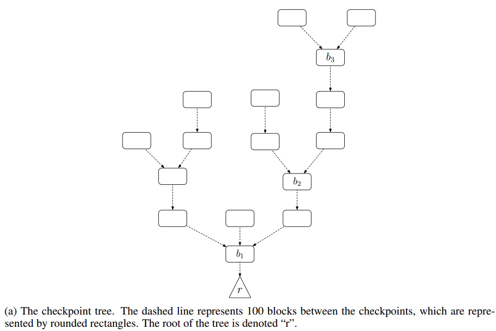
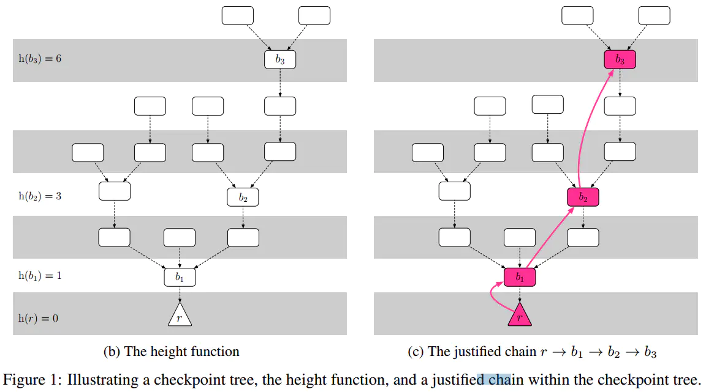
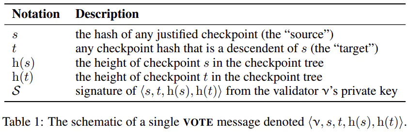
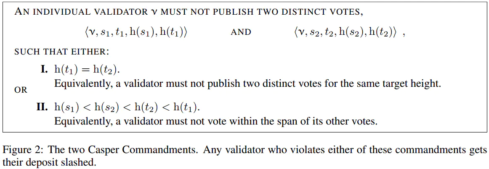
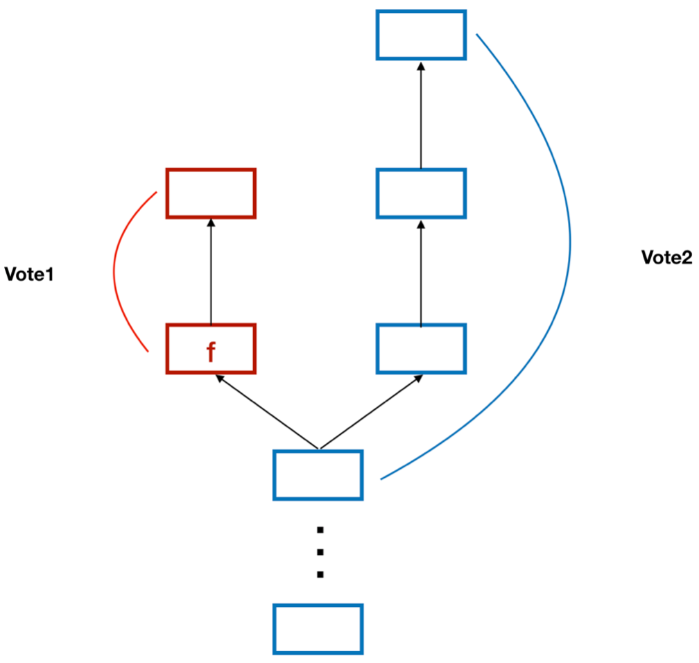
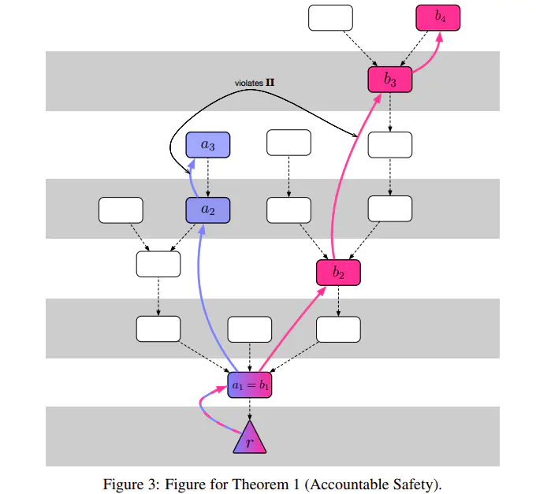
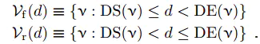
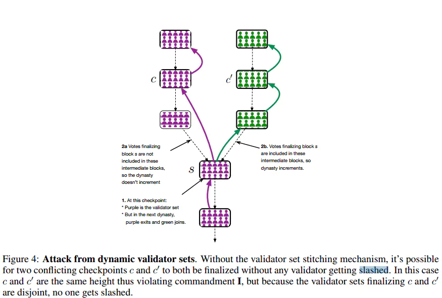
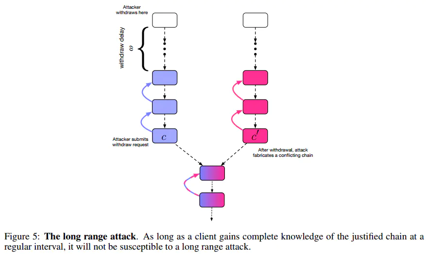

# 介绍
权益证明设计有两个主要的思想流派：
- 基于链的权益证明*chain-based proof of stake*，模仿PoW机制，并以一系列区块为特征，并通过伪随机赋予利益相关者创建新区块的权利来模拟挖掘。以Peercoin，Blackcoin，和Iddo Bentov为代表。
- 基于拜占庭容错(BFT)的权益证明*Byzantine fault tolerant based proof of stake*。对拜占庭容错有了三十多年的研究。例如：实用拜占庭容错(PBFT)。 BFT算法通常具有经过验证的数学特性。例如，通常可以在数学上证明只要2/3个协议参与者诚实地遵循协议，那么，无论网络延迟如何，算法都能保证无法出现冲突区块。

# 我们的工作
Casper the Friendly Finality Gadget(Caper FFG)是一个顶层的提议机制用来解决谁提议区块的问题。Casper负责最终确定这些块，主要是选择一个代表分类帐规范交易的唯一链。 Casper提供安全性，但是活力取决于所选择的提议机制。 也就是说，如果攻击者完全控制提议机制，Casper可以防止最终确定两个冲突的检查点，但是攻击者可以阻止Casper完成任何未来的检查点。

Casper引入了BFT算法不必要支持的几个新功能：  
- **问责制**：如果***validator***（验证者）违反规则，我们可以检测到违规并知道哪个*validator*违反了规则。问责制允许我们惩罚恶意*validator*，解决困扰基于链的PoS的“无利害关系”(*Nothing at Stake*)问题。违反规则的处罚是验证人的全部存款。这种最大惩罚是防止违反协议。因为权益证明的安全性是基于罚款的大小，其可以设定为大大超过挖矿报酬的收益，所以股权证明提供了比工作证明更严格的安全激励。
- **动态验证者**：我们引入了一种安全的方法使***validator set***（验证者集合）随时间进行变化。
- **防御性**：我们引入了针对长程攻击的防御以及超过1/3的*validator*掉线的攻击，代价是非常弱的权衡同步性假设。
- **模块化叠加**：Casper的设计成叠加层的模式使其更容易实现对现有PoW链的升级。

## 对此理解
- 问责制：质押32BETH，成为验证节点。验证节点通过下注提议来获取奖励。对于作恶节点进行罚款。
- 动态验证者机制：信标链每个epoch重新选举委员会。

### 长程攻击 *long range attack*

#### 工作量证明的弱主观性
- 在工作量证明区块链中我们基于这样一个假设，除非遭遇了 51% 攻击，不可能有其它从创世区块开始并与当前主链存在潜在竞争关系的分支链。而对于一个企图篡位的分支链，要达到当前主链那样的长度，**必然耗费巨量的算力**。所以对采取工作量证明协议的区块链，最长链原则已经足够解决弱主观性问题了。

#### 无利害关系 *nothing at stake*
- “无利害关系”问题指的是，权益证明机制中的矿工最佳的策略是在所有的分叉链上进行挖矿，因为签名的制造非常的便宜。*validator*仅仅是从交易池中取交易，打包到区块中，然后广播出去，仅此而已。所以说，几乎不消耗算力资源来创建一条从创世区块开始的长分支链的能力。而在工作量证明机制上需要付出算力成本，所以不存在此问题。所以Casper需要引入保证金机制来解决经典权益证明协议中做坏事的代价很低的问题。 

任何加入到权益证明区块链的新节点都会接收到多条分支链，其中很大一部分长度也相同。由于无利害关系和弱主观性 ，仅仅依凭最长链原则不足以判断哪一条是主链。长程攻击恰恰利用了权益证明协议区块链的这两个特点。

# Casper协议

在以太坊中，最初的提议机制是现有的PoW，使Casper的第一个版本成为混合PoW / PoS系统。 在未来版本中，PoW提议机制将被更有效的方式替代。 例如，我们可以想象将区块提议转换为某种PoS循环区块签名方案。

在Casper的这个简单版本中，我们假设有一组固定的*validator*和一个提议机制（例如，我们熟悉的PoW机制），它产生现有块的子块，形成一个不断增长的区块树。 根据*比特币白皮书*，树的根通常被称为“创世区块”。

在正常情况下，我们期望提议机制通常在链表中一个接一个地提出区块（即，每个“父”块恰好有一个“子”块）。 但是在网络延迟或故意攻击的情况下，提议机制将不可避免地偶尔产生同一父块的多个子块。 Casper的工作是从每个父块中选择一个子块，从而从区块树中选择一条规范链。

为了提高效率，Casper只考虑***checkpoint tree***（检查点子树）（图1a），而不是处理完整的区块树。 创世区块是一个检查点，区块树中高度（或块号）为100的倍数的每个区块也是一个检查点。 区块高度为100 * k的区块的“检查点高度”仅为k; 等价地，检查点c的高度h(c)是检查点链中区块的数量，从c沿着父链一直延伸到根（图1b）。

每个验证人都有押金; 当验证人加入时，其存款是存入的货币数量。 加入后，每个验证人的存款都会随着奖励和罚款而上升和下降。 权益证明的安全性来自存款的大小，而不是验证人的数量，因此对于本文的其余部分，当我们说“2/3的*validator*”时，我们指的是存款加权分数; 也就是说，一组验证人，其总存款大小占整个*validator set*的总存款大小的2/3。

*validator*广播信息需要包含（表1）中四条数据的投票消息数据以及一条签名数据：两个检查点s和t以及它们的高度h(s)和h(t)。 我们要求s是检查点树中t的祖先，否则投票被视为无效。 如果*validator* : ν的公钥不在*validator set*中，则该投票被视为无效。以及连同*validator*的签名信息，我们将以`⟨ν, s, t, h(s), h(t)⟩`的形式投票。

**理解：**Casper FFG的这种投票消息，很巧妙地把二步融合到一个步骤里了，本质上它还是跟pBFT, Tendermint里的二阶段投票等价，pre-prepare->prepare, pre-vote -> pre-commit。

## 我们定义以下术语：

- ***supermajority link*** 是一对有序的*checkpoint*（a，b），也写成`a→b`。至少有2/3的*validator*（存款额度的2/3）发布了对源a和目标b的投票。 *supermajority link*可以跳过*checkpoint*，即`h(b) > h(a) + 1`也是允许的。图1c显示了红色的三个不同的绝对多数链路：`r→b1`，`b1→b2`和`b2→b3`。
- 当且仅当两个*checkpoint* a和b是不同分支中的节点时，它们被称为***conflicting***，即，它们都不是另一个的祖先或后代。
- 如果*checkpoint* c是根，或者存在*supermajority link* c'→c，其中c'是*justified checkpoint*，则*checkpoint* c被称为***justified checkpoint***。 图1c显示了*justified checkpoint*。
- 如果*checkpoint* c被证明是合理化的并且存在*supermajority link*c→c'，其中c'是c的直接子项，则称其为***finalized checkpoint***。 等价地，*checkpoint*c是最终确定的*checkpoint*当且仅当：*checkpoint*c是合理化的，z存在*supermajority link*c→c'，*checkpoint*c和c'*no conflicting*，并且`h(c') = h(c) + 1`。

## 惩罚
为了防止*validator*在运行的过程中作恶，Casper制定了一套惩罚机制如下：对于相同的*validator*，发布了两个不同的投票vote=<v , s1 , t1 , h(s1) , h(t1)> 和vote=<v , s2 , t2 , h(s2) , h(t2)> ，如果存在以下两种情况之一则罚抵押的stake。

1. h(t1) = h(t2)：对于同一个目标高度，不能发起两个不同的投票。

2. h(s1)< h(s2) < h(t2) < h(t1)：两个投票的投票范围不能存在一个包含另一个。

我们来看一下在合法的交易的情况下，*justified* 和 *finalized* 是如何保证 *checkpoint* 的安全性的。当一个 *checkpoint* : c 成为了 *justified*，说明有超过2/3的 *validator* 支持 c 之前所有的 *checkpoint*，配合着第一个惩罚条件，在h(c)有超过2/3的*validator*唯一支持 *checkpoint* c。对于 *finalized* 的*checkpoint* : f，他会有一个从f出发，连接到f的子节点的 *supermajority link*。配合第二个惩罚条件，当一个 *checkpoint* f 成为了 *finalized*，说明全网超过2/3的 *validator* 不能发出跨越f的投票，这2/3的 *validator* 只能对f之后的 *checkpoint* 进行投票。如图2-2所示：对于任意一个 *validator*，在投出了 vote1之后就无法投 vote2，因此 f 之前的 *checkpoint* 将不会被改变，因为任意对于f之前 *checkpoint* 的投票都无法获得超过2/3的投票。 

Casper最值得注意的特性是，如果没有≥1/ 3的 *validator* 违反两个Casper戒律或惩罚条件之一，就不可能最终确定两个相互冲突的检查点（图2-1）。

如果 *validator* 违反了任何惩罚条件，则违规的证据可以作为交易包含在区块链中，此时 *validator* 的全部存款将被拿走作为给证据交易提交者的小“发现者费用”。 在目前的以太坊中，停止执行惩罚条件需要对以太坊的工作量证明区块提议者进行成功的51％攻击。

# 证明安全和合理的活性
下面我们证明Casper的两个基本属性：可问责的安全性和合理的活性。可说明的安全性意味着两个相互冲突的检查点不能同时最终确定，除非≥1/ 3的 *validator* 违反惩罚条件（意味着至少有三分之一的存款丢失）。 合理的活性意味着，无论以前发生过什么事件（例如，惩罚事件，延迟区块，审查攻击等），如果≥2/ 3的 *validator* 遵循协议，那么总是可以在没有任何 *validator* 违反惩罚条件的情况下完成新的检查点。

假设按权重计2/3的 *validator* 没有违反惩罚条件，我们有以下属性：

1. 如果s1→t1和s2→t2是不同的绝对多数链路，那么h(t1) != h(t2)。
2. 如果s1→t1和s2→t2是不同的绝对多数链接，则不等式h(s1) < h(s2) < h(t2) < h(t1)不能成立。

从这两个属性中，我们可以立即发现，对于任何高度n：

3. 最多存在一个绝对多数链接: s→t，其中h（t）= n。
4. 最多存在一个高度为n的合理检查点。
有了这四个属性，我们转向主要定理。

> **定理1(问责安全)(Accountable Safety)：** 两个冲突的检查点a[m]和b[n]不能同时被最终确定。
证明：设a[m]（有正当直接孩子a[m + 1]）和b[n]（有正当直接孩子b [n + 1]）是不同的最终检查点，如图3所示。现在假设a[m]和 b[n]冲突，并且不失一般性h(a[m]) < h(b[n])（如果h(a[m]) = h(b[n])，则很明显1/3 验证者违反了条件I）。 设r→b [1]→b [2]→···→b [n]为检查点链，使得存在绝对多数链路r→b [1] ,.。 。，b [i]→b [i + 1] ,.。。 ，b [n]→b [n + 1]。 我们知道没有h(b[i])等于h(a [m])或h(a[m + 1])，因为这违反了属性（iv）。 令j为最小整数，使得h(b[j]) > h(a [m + 1]); 然后h(b[j -1]) < h(a[m])。 然而，这意味着存在从具有小于h(a[m])的纪元数的检查点到具有大于h(a[m + 1])的纪元数的检查点的超大多数链接，这与从a[m]到a[m + 1]的绝对多数链不兼容。

> **定理2(合理的活性)(Plausible Liveness)：** 如果存在扩展最终链的子项，则可以始终添加绝对多数链接以生成新的最终检查点。

# Casper的分叉选择规则
Casper比标准PoW设计更复杂。因此，必须调整分叉选择。我们修改后的分叉选择规则应该被所有用户，验证器，甚至底层块提议机制所遵循。如果用户，验证者或块提议者改为遵循“始终在最长链上建立”的标准PoW分叉选择规则，则存在Casper被“卡住”的病态场景，并且在最长链上建立的任何区块都不能最终确定（甚至是合理的），除非有一些验证者无私地牺牲他们的存款。为了避免这种情况，我们引入一种新颖的，正确实施的(correct by construction)分叉选择规则：**遵循包含最高高度的合理检查点的链**。这个分叉选择规则是正确的，因为它遵循合理的活动证明（定理2），它精确地说明总是可以在具有最大高度的合理检查点顶部完成新的检查点。此分叉选择规则将在第3节和第4节中进行调整。

# 启用动态验证人集合
验证器集需要能够更改。新的验证器必须能够加入，现有的验证器必须能够离开。为了实现这一点，我们定义了一个块的朝代。区块b的朝代是从根到区块b的父节点链中的最终检查点的数量。当一个可能的验证者的存款消息被包含在具有朝代d的块中时，验证者ν将加入朝代d + 2的验证者集合。我们称d + 2这个验证者的起始朝代DS(ν)。

要离开验证者集合，验证者必须发送“提款”消息。如果验证者ν的提款消息包含在具有朝代d的块中，则类似地将验证者将离开具有王朝d + 2的区块的验证者集合;我们称d + 2为验证者的结束朝代，DE(ν)。如果尚未包括提款消息，则DE(ν)=∞。一旦验证者ν离开验证者集合，验证者的公钥将被禁止重新加入验证者集合。这消除了处理单个身份的多个开始/结束朝代的需要。

在结束朝代开始时，验证人的存款被锁定很长一段时间，称为退出延迟（认为是“四个月的区块”），然后才能取消存款。如果在撤回延迟期间，验证人违反任何戒条，则押金将被没收处罚。

我们定义了两个函数，为任何给定的朝代d生成两个验证器子集，前向验证者集合和后向验证者集合。它们被定义为，

注意这意味着朝代d的前向验证者集合是朝代d + 1的后验证者集合

请注意，为了使链能够“知道”它自己当前的朝代，我们需要稍微限制我们对“最终确定”的定义：之前，如果检查点c是合理的并且从c到任何其直接子检查点存在绝大多数的链，则检查点c是最终确定的。现在，最终确定还有一个附加条件 -- 只有当绝大多数链接c→c'的投票以及递归证明c的所有绝对多数链接都被包含在c'的子代之前的区块链中时，才能最终确定，（在区块号h(c')* 100之前）。为了支持动态验证者集合，我们重新定义了绝对多数的链接和最终确定，如下所示：

- 一对有序的检查点（s，t），其中t在朝代d中，如果朝代d中至少有2/3的前向验证者已经公布了投票s→t，并且朝代d中至少有2/3的后向验证者已经公布了投票s→t，则表示具有绝对多数的链。
- 原先，如果c是合理的，并且c→c'中存在绝对多数链接，其中c'是c的子节点，则检查点c被认为最终确定的。我们添加了这样的条件：只有当绝大多数链接c→c'的投票以及证明c合理的绝对多数链被包含在c'的区块链中，并且在c'的子块之前-在区块号h(c')* 100之前。

前后验证器组通常会大部分重叠;但是如果两个验证者结合基本上不同，这种“缝合”机制可防止在最终检查点的两个孙子具有不同朝代的情况下的安全失败，因为证据包含在一个链中但不包括在另一个链中。有关此示例，请参见图4。

# 阻止攻击
有两种众所周知的针对权益证明系统的攻击：长程攻击和灾难性崩溃。 我们依次讨论每个问题。

## 长程攻击
验证者结束朝代之后的退出延迟引入了验证者与客户之间的同步性假设。 一旦验证者联盟撤回了他们的存款，如果该联盟过去很久以前有超过2/3的存款，他们可以利用他们的历史绝对多数来完成相互冲突的检查点的最终确定，而不必担心被没收处罚（因为他们已经撤回了他们的钱）。 这称为长程攻击，见图5。

简单来说，分叉选择规则阻止长程攻击永远不会恢复最终确定的块，并期望每个客户端能以某个常规频率“登录”并获得链的完整最新视图（例如，每1-2个月一次）。 一个最终确定更老区块的“长程修订版”的分叉将被忽略，因为所有客户端都已经看到在该高度的最终块，并拒绝反转它。

(忽略了证明部分的翻译)

## 灾难性崩溃
假设大于1/3的验证者同时崩溃 - 即，由于网络分区，计算机故障或验证者本身是恶意的，它们不再连接到网络。 直观地说，从这一点来看，不能创建绝对多数的链接，因此无法最终确定未来的检查点。

我们可以通过建立“不活动泄漏”来从这种情况进行恢复，这种泄漏会慢慢消耗任何不给检查点投票的验证人的存款，直到最终其存款规模减少到足以使投票的验证人为绝对多数。 最简单的公式就像“在每个时代，存款大小为D的验证人未能投票，它失去D * p（0 < p < 1）”，但对长时间未完成最终确定的区块使用增加泄漏率的公式以更快地解决灾难性崩溃，可能是最佳的。

这种泄漏的ether可以被销毁或在ω天后返回验证者。 泄漏资产是否应该被烧毁或返还以及不活动泄漏的确切公式超出了本文的范围，因为这些是经济激励的问题，而不是拜占庭式的容错。

不活动泄漏引入了两个冲突的检查点被最终确定而没有任何验证者被削减的可能性（如图6所示），验证者只在两个检查点中的一个上损失金钱。 假设验证者被分成两个子集，子集V[A]对链A投票和子集V[B]对链B投票。在链A上，V[B]的存款将泄漏，反之亦然，导致每个子集在其各自的链上具有绝对多数， 允许最终确定两个冲突的检查点，而不会明确地削减任何验证者（但由于泄漏，每个子集将在两个链中的一个链上丢失大部分存款）。 如果发生这种情况，那么每个验证者应该只是支持它首先看到的最终检查点。

从这些各种攻击中恢复的确切算法仍然是一个悬而未决的问题。 目前，我们假设验证者可以检测到明显的不良行为（例如，不包括证据）并手动创建“少数软分叉”。 这种少数派分支本身可以被视为区块链，与市场中的多数链竞争，如果多数链真正通过串联恶意攻击者来操作，那么我们可以假设市场将偏向少数派。

# 结论
我们介绍了Casper，这是一种来自拜占庭容错文献的新颖的权益证明系统。 Casper包括：两个削减条件，一个受[11]启发的正确构造的分叉选择规则，以及动态验证者结合。 最后，我们介绍了Casper的扩展（不反转最终检查点和不活动泄漏）来防御两种常见的攻击。

Casper仍然不完美。 例如，完全受损的区块提议机制将阻止Casper完成确认新块。 Casper是对几乎所有PoW链的基于PoS的严格安全性改进。 Casper没有完全解决的问题，特别是与51％攻击相关的问题，仍然可以使用用户激活的软叉进行纠正。 未来的发展无疑将提高Casper的安全性并减少对用户激活的软叉的需求。

**未来的工作**。 当前的Casper系统建立在PoW区块提案机制之上。 我们希望将区块提案机制转换为权益证明(PoS)。 即使验证者集合的权重随奖励和处罚而变化，我们也希望证明其可靠的安全性和合理的活力。 未来工作的另一个问题是对分叉选择规则的正式规范，考虑到对权益证明的常见攻击。 未来的工作报告将解释和分析Casper的经济激励及其后果。 与阻止攻击者的这种自动化策略相关的特定经济问题证明了不同客户端之间的不一致程度与攻击者所产生的成本之间的比率的上限。
##
# 引用和参考文献
> [Casper the Friendly Finality Gadget [Latest commit 61ae146 on 29 Oct 2017]](https://github.com/ethereum/research/blob/master/papers/casper-basics/casper_basics.pdf)  
[【文章翻译】Casper FFG基础](https://www.jianshu.com/p/6fd6d4f97ddd)