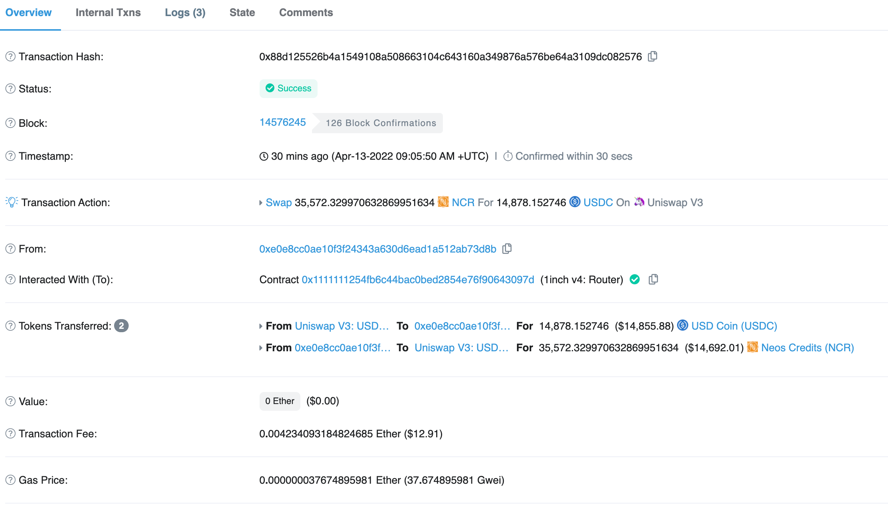

# 三明治攻击案例分析

## 抢跑阶段
1. Mev bot在uniswap-v2上卖出ETH买入NCR。
2. 再将买入的NCR在uniswap-v3上卖出，买入USDC。引起USDC在uniswap-v3的NCR-USDC LP池中升值抬高了接下来受害者交易的成本。（其他池不受影响）


https://etherscan.io/tx/0xc6d53c38434effa63fdf3b763759b1fa9699219af99c9e5efca53a8bbb44804a
## 受害者行为
受害者在uniswap-v3用较高的成本上卖出大量NCR，买入USDC。


https://etherscan.io/tx/0x88d125526b4a1549108a508663104c643160a349876a576be64a3109dc082576
## 尾随阶段
1. Mev bot在uniswap-v3上卖出USDC买入NCR成功换出更多的NCR。
2. 再将换出的NCR在uniswap-v2上卖出，换回WETH。


https://etherscan.io/tx/0x0f66853c690105c5f3a080ce75d75a04a35bd4eb8618f7878ee7e0e3dd53ab82
## 利益分析
用户损失\Mev Bot毛利润：0.099336744926763451 ether（$303.53）

Mev Bot净利润（去除矿工费）：0.001781203268032581 ether（$5.44）

矿工净利润（去除basefee）：0.08727896012374656 ether（$266.69）

燃烧费用：0.00978678484422912 ether（$29.9）

在此利益分配中，矿工通过套利交易手续费获取套利总额的97.46%
## uniswap公式


最后把$\theta=1-\rho$（对于uniswap是0.3\%）代入公式:
$$\Delta{y}=(997·\Delta{x}·y)/(997·\Delta{x}+1000x)$$
公式符合UniswapV2Library的getAmountOut函数。


# Flashbots Auction
Flashbots Auction提供私人交易池 + 密封投标区块空间拍卖机制，允许区块生产者无需信任地外包寻找最佳区块构建的工作。
在常规的以太坊交易池中，用户将交易广播到公共点对点网络并指定一个燃料价格，该价格表明他们愿意为以太坊链上的每个计算单元支付多少。矿工收到这些交易，按gas价格排序，并使用贪心算法生成一个区块，试图通过交易费用获得最大价值。
以下是该机制的关键问题：
- 用户为了抢占套利机会，纷纷通过提高gas price，以便抢占第一个套利机会（只有第一笔套利能够成功），在短时间内使gas price巨幅提升，影响网络稳定。
- 只有一笔套利交易可以成功，其他的交易均失败，消耗区块链空间。
- 恶意用户为了抢占套利机会，这导致了诸如垃圾邮件之类的替代策略来增加获胜的可能性，从而进一步增加无谓损失。
相反，Flashbots Auction基础设施使用第一价格密封投标拍卖，允许用户私下交流他们的投标和细化交易订单偏好，而无需为失败的投标付费。这种机制最大限度地提高了矿工的收益，同时为给定 MEV机会价值的价格发现提供了一个有效的场所。至关重要的是，这种机制消除了抢先漏洞。
## 技术架构


Flashbots Auction引入了一种新的eth_sendBundleRPC请求，它标准化了通信通道中的消息格式。此消息称为“Flashbots Bundle”。目的是将多笔交易顺序捆绑，竞拍后交由矿工出块。
```js
{
  "jsonrpc": "2.0",
  "id": 1,
  "method": "eth_sendBundle",
  "params": [
    {
      txs,               // Array[String], A list of signed transactions to execute in an atomic bundle
      blockNumber,       // String, a hex encoded block number for which this bundle is valid on
      minTimestamp,      // (Optional) Number, the minimum timestamp for which this bundle is valid, in seconds since the unix epoch
      maxTimestamp,      // (Optional) Number, the maximum timestamp for which this bundle is valid, in seconds since the unix epoch
      revertingTxHashes, // (Optional) Array[String], A list of tx hashes that are allowed to revert
    }
  ]
}
```

# 搬砖套利
因为DEX各池子的价差，Mev Bot分析后在DEX之间搬砖套利。
## 案例具体过程
1. Mev Bot在sushiswap卖出7.38WETH，买入2698.66 RUNE。
2. 随后再将买入的2698.66 RUNE在uniswap-v3卖出换成7.70个WETH完成套利。


https://etherscan.io/tx/0xa8930ae6a17a679ea5abd4b7274dc27416be5d62379c848ade8779e876986f7b
## 利益分析
Mev Bot毛利润：0.329689032623411672 ether（$1021.11）

Mev Bot净利润：0.314207274249977546 ether（$973.16）

矿工利润：0.011232792714802698 ether（$34.79）

# 简单的搬砖套利程序
Flashbot提供一个简单的套利工具，用于从两个DEX中相同的LP池套利。
https://github.com/flashbots/simple-arbitrage
## 具体流程
1. 获取两个DEX所有LP池的reserves数据。
2. 计算两个DEX相同的LP池reserves的可套利空间。
3. 构造交易调用链上部署好的FlashBotsMultiCall合约。
4. 将交易构建完成，模拟交易，如果成功则构建simulate。
5. 将simulate发送给flashbots。


## 项目不足的地方
计算最佳收益使用二分搜索的方式，时间复杂度高，并且代码不完善、不精确。


## 改进
理论上交叉套利是存在一个最值的，我们可以通过uniswap的公式统一成一个交叉套利的公式，求出最值。此公式论文：https://arxiv.org/pdf/1911.03380.pdf
github上也有大神通过此论文改进了getBestCrossdMarket函数：https://github.com/jacksonConrad/better-simple-arbitrage


### 输出结果


# 参考文献
> https://www.cxyzjd.com/article/sanqima/109667469
> https://arxiv.org/pdf/1911.03380.pdf
> https://docs.flashbots.net/flashbots-auction/overview
