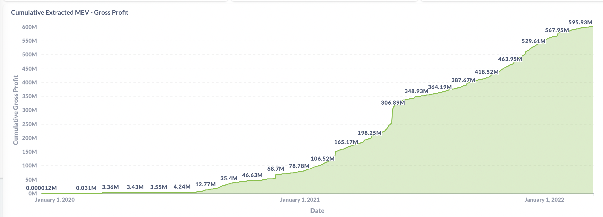
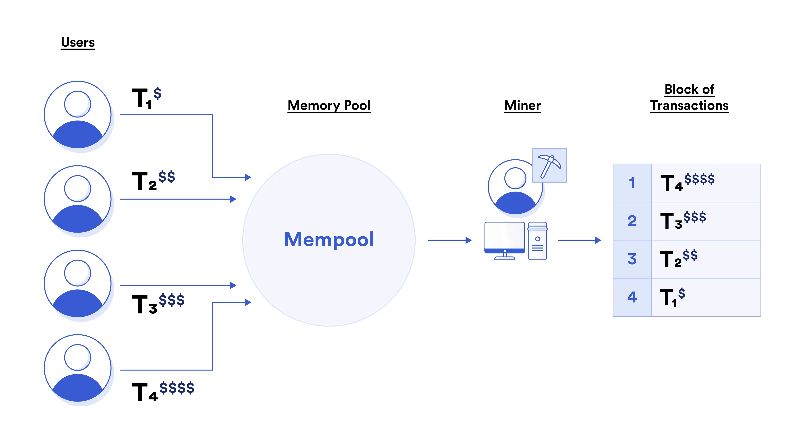
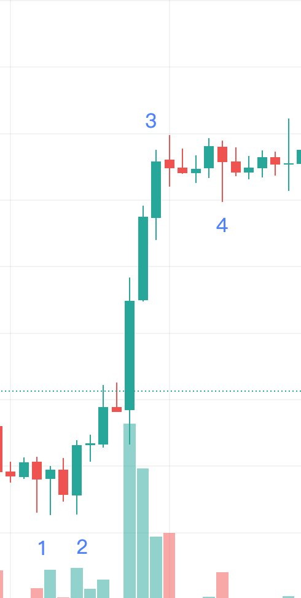
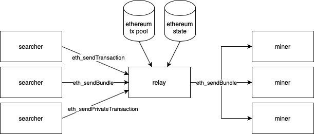
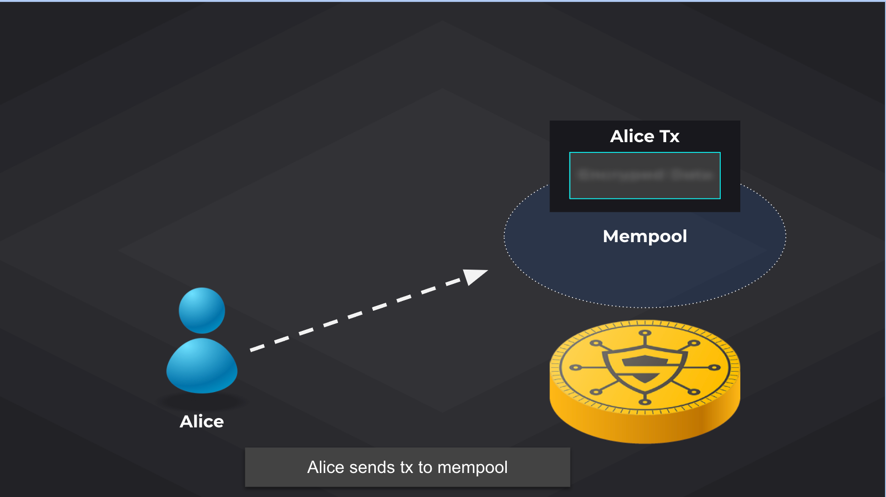
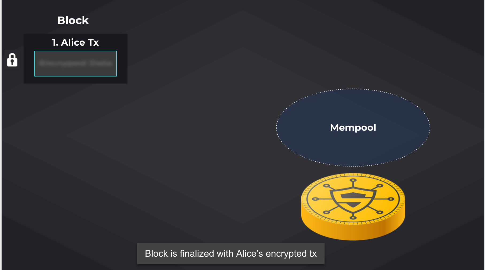
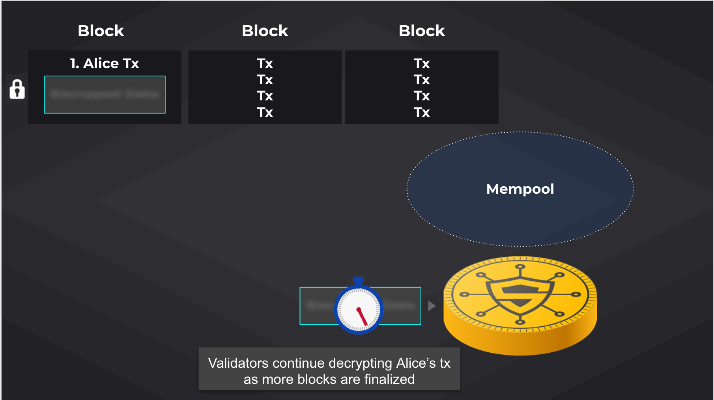
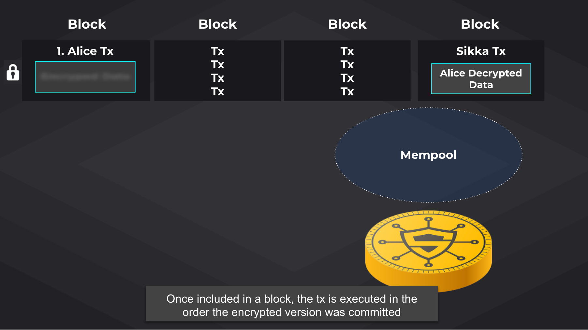
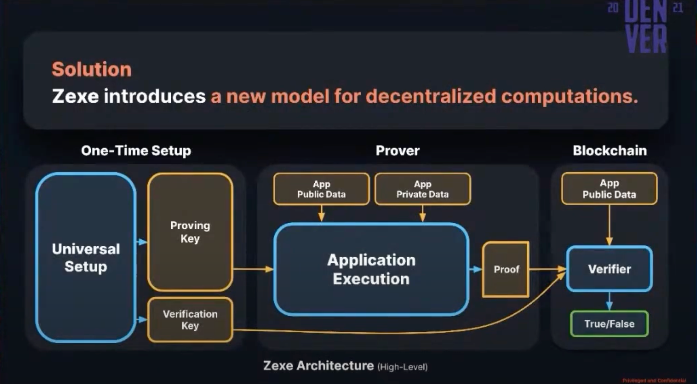

# 什么是MEV
`MEV`是矿工可提取价值（`Miner Extractable Value`）的缩写。由于区块链并没有要求矿工对交易打包顺序做出强制要求，矿工是可以自主选择对内存池中的待处理交易进行重新排序，由此矿工从用户那里获得了额外的利润，这部分利润价值就被称为`MEV`。

`DeFi`的兴起。`MEV`价值呈指数增长。

浏览器链接：<https://explore.flashbots.net/>

# 存在的角色
## 矿工
矿工是工作量证明机制的核心。矿工的工作任务是将用户发来的交易进行打包，并通过工作量证明提交到区块链上。

矿工可以在不影响交易原子正确的前提下对多笔交易进行排序、包含、剔除等操作。

通常来说，矿工为了寻求利润最大化会将**待打包的交易**交易按照`gas price`进行排序。然后将最前面的`N`笔交易进行打包入块。

当然出于某些场景需求，矿工也可以按照他们想要的交易顺序进行打包。比如矿池定制化交易加速功能、对异常地址进行风险控制等等。例如：
[比特大陆交易加速服务](https://pushtx.btc.com/)

## 套利机器人
虽然现在常用的说法是“矿工可提取价值”，但实际上大多数`MEV`行为是由第三方机器人，而非矿工，发起的。这些机器人通过提高支付给矿工的交易费来操纵区块中的交易排序。这意味着就算矿工仅按照`gas price`高低排序交易，也会出现`MEV`问题。然而，`MEV`还可以被视作是矿工可以提取的最大价值上限，因为矿工是最终决定区块中交易顺序的一方。

# 如何套利
## 有利的套利
如果套利发生在「世界状态」发生之后，套利机器人对市场变化作出的合理的反馈。那么这种套利即是合理的套利。
### 搬砖套利
用户在交易平台进行了一笔大额交易导致价格下滑，产生了较大的套利空间。套利机器人进行套利交易，将市场价格套利至真实价格水平。此类型的提取`MEV`大多是发生在链上事务发生后，套利机器人对市场进行反应，不会损害原始交易者的利益。
txid:[0xb72689042f313adbffbe4d192b0febc4c8a8346b75a549d5b4d4795b37180488](https://etherscan.io/tx/0xb72689042f313adbffbe4d192b0febc4c8a8346b75a549d5b4d4795b37180488)
### 清算机器人套利

有些协议的运转需要依赖于`MEV`，比如对`Aave Protocol`、`MakerDAO`、`Compound`的清算。在`DeFi`抵押借贷协议中，当抵押物价值下降时，如果没有补足或者出售抵押资产，就会触发清算程序。清算人可以以低于市场价格3%-5%的折扣，获得如`ETH`这样的抵押资产，而这3%-5%的折扣价值，就是`MEV`。
## 有害的套利
如果套利发生在「世界状态」改变之前，即机器人有预知「世界状态」改变的能力，那么这种操作会危害于区块链上的正常参与者。
### 三明治攻击

试想下，如果我们有能力在大资金买卖交易前后各插入一笔交易（买在低点，卖在高点）岂不是是一个稳赚不赔的策略？

如图所示，套利机器人过程主要分以下4个阶段。

- 阶段一：用户创建大额买单交易并进行广播，此时交易在内存池中未打包入块。
- 阶段二：套利机器人从交易内存池中捕获到用户交易，计算交易可套利价值空间，构造两笔交易进行广播。一笔以高于用户`gas price`创建买单进行广播，另一笔以低于用户`gas price`创建一笔卖单。
- 阶段三：交易机器人买单先成交，随后用户交易成功打包入块，价格拉升。
- 阶段四：价格拉升后，交易机器人卖单成功打包入块，完成套利。

矿工与套利机器人的收益来源是用户损失的部分。

# MEV对网络的危害
- 拉高手续费：当`DeFi`各类资产价格发生波动，可套利的机会与利润空间也越来越多。机器人纷纷抬高`gas price`来争抢这笔利润，短时间使手续费价格巨增。

- 增加无效交易数量：`MEV`最终只会有一笔交易可以成功套利，其他的都会以失败告终。这些无效的交易也会像垃圾一样占用区块链的空间。

- 损害用户利益：套利机器人为了争抢套利机会，往往会抬高交易费，支付的交易费往往占套利所得收益的很大比例，而这些交易费最终直接落入了矿工的口袋。也就是说，虽然矿工没有亲自开展套利交易，但仍是这类`MEV`行为的最大受益者。

- 区块链频繁重组风险：对于矿工来说，如果`MEV`的价值远大于重组区块带来的损失。那么众多矿工都会尝试对不利于自己的区块进行重组。这导致的后果包括：交易确认时间变长，用户在平台的体验下降；增加了51%算力攻击的可能性。

**MEV本质上是个零和游戏，损失的是链上用户，受益的是矿工和套利者。**

# 缓解MEV重组风险
- 额外的安全性激励：除了区块奖励之外(如`EIP-1559`提议销毁的`BaseFee`，或状态租金)，稳定的矿工收入来源是对协议安全的补充，并可以帮助缓解`MEV`问题。
- 最终确定性 (`Finality`)：工作量证明 (`PoW`) 只有概率上的最终确定性。而基于拜占庭容错的算法（`BFT`）更能保证最终确定性，并且仅仅重组单个被敲定的区块就需要程度更深的合谋，该算法使得时间盗贼攻击更加困难。然而，如果`MEV`的激励足够高，那么即使合谋的难度较高也值得尝试了。再者，参与者对于其提议的区块，仍然有权任意排序交易，因此仅凭最终确定性无法解决“一般”的抢跑交易问题。
- 权益证明 (`Proof-of-Stake`)：基于新一代`PoS`的区块链（`Casper FFG`、`Tendermint`）中，尝试重组的验证者会遭受罚没惩罚，因此使得时间盗贼攻击成本更高，尤其是与最终确定性结合时。然而，只要`MEV`的激励足够高，即使在罚没惩罚的警示下也可能会捕获`MEV`。

以上方案在一定程度上缓解了矿工为了利益频繁重组区块带来的风险，但是对于套利机器人并无作用。

## 项目与服务
- `Flashbots`：是一家旨在降低由矿工可提取价值 (`MEV`) 对智能合约公链构成负外部性影响和存在风险的研发机构，该机构希望为智能合约公链打造一个无需许可、透明、公平的生态系统。（`mev-geth`和`mev-relay`）。他们的密封投标拍卖模型允许任何人通过贿赂提交交易，从而减轻以太坊网络的压力并减少矿工为最大化`MEV`所需的串通数量。对于同一笔套利只有一笔交易能够通过`mev-relay`下发给矿工，从而缓解了网络的拥堵以及手续费的水涨船高。但是并没有解决普通用户的三明治攻击问题。

- `Taichi Network`：由目前以太坊算力第二大矿池星火矿池创立，用户可以通过太极网络提供的接口直接发送交易到星火矿池的隐私池。由于星火矿池并不对这笔交易进行网络公开发布，这笔被发送出去的交易在未被正式确认前，在`Etherscan`上无法看到该笔交易的状态。
- `bloXroute`：提供隐私通信功能，允许交易在不被暴露的情况下直接到达矿工手中。`bloXroute`的`BDN`（区块链分发网络）通过自己的网关软件将区块链节点与`BDN`链接，网关软件和区块链节点首先翻译从区块链进入`BDN`的信息。然后，在第二层，它会进行区块压缩。通过极大缩小区块大小，使其随后更高效地在区块链分发网络（`BDN`）中发送/传输。

以上方案都在一定程度上解决了套利机器窥视内存池交易所带来的「抢跑」，但无法解决矿工本身套利的问题。

# 如何使用技术手段来避免MEV
思路是：交易可以在`memory pool`存储池中加密，并在排序完成后解密。这样任何人在交易定序前都不知道交易的内部细节。
## 可信式硬件（Trusted Hardware）

`SGX`代表`Software Guard eXtensions`，这是一个提供硬件内存加密的指令集，其中特定的代码和数据被隔离在「飞地」中，它们可以在不暴露于外部代码的情况下运行。

它以如下流程运行:
- 每个矿工都有一个`SGX`，他们有一个协议，用于共享只有在`SGX`中才能访问的加密密钥。
- 所有`p2p`内的交易都需要通过`SGX`内给定的公钥进行加密。
- `SGX`内部可以解密并验证交易的合法性，并构造一个`pending block`，并将`block hash`发送给外部用于`PoW`计算。
- 外部计算出`PoW`值后提交给`SGX`，`SGX`验证合法后将完整区块返还给外部进行广播。

优点：可以不用修改现有协议，`SGX`可以作为一个选项，添加到现有协议中。
缺点：虽然解决了交易内存池的可见性，抵挡了外部机器人对`memory pool`的窥视，但是对于矿工来说。如果`MEV`的价值远远大于报块可获得的奖励，矿工将在解密交易后重新`rehash`（非确定性共识下，例如`PoW`)。并且`SGX`依赖`intel`的指令集，并不能保证绝度安全。如果当利益足够大的情况下，某人通过`SGX`的漏洞找到私钥这个系统就不能运行了。

## 基于时间锁加密（TimeLock Encryption）
代表：`STARKware’s Veedo`
将交易进行加密后到内存池中，由矿工将加密后的交易打包到区块链上（事务为执行），同时将私钥通过例如`VDF`（[可验证延迟函数](https://blog.priewienv.me/post/verifiable-delay-function-1/))等方式，交由矿工进行延迟解密。`N`个块后矿工成功解密，将解密后的交易和`Proof`提交到区块链上进行验证，此时事务将真正执行。

- 所有的交易都需要加密，任何人都可以在`X`个计算周期后完成解密。
- 矿工将在加密交易上链后`N`区块开始解密，并在`N+X`区块后完成解密并提交到区块链上。
- 矿工必须在`N+Y（Y>X）`个区块之前完成解密交易的上链，否则交易将失效。

流程如下：
- 用户将经过同态隐藏的信息（可能是`hash`）交给矿工进行打包。

- 矿工成功将数据写入区块。

- 矿工对`VDF`进行解密（`VDF`保证在`N`个块之后才能解开），同时产生新的区块。

- `N`个块后，矿工解开交易生成解密后的交易和一个`Proof`，合约验证`Proof`的合法性再将解密后的数据写入区块链。

**缺点：** 所有的交易都得过这套系统，不能作为一个选项。并且交易有延迟对用户体验不好。有一个风险是当加密的交易不能及时上链，交易被解密。
**优点：** 对共识时间影响较小。矿工不需要花费额外的精力去处理交易解密本身。

## 门限密码系统 Threshshold Encryption
代表：`ChainLink FSS`
一种门限密码系统，该领域的基础门限密码学，是密码系统通过对信息进行加密并将其分发到容错计算机群集中来保护信息。该消息使用公钥，并且对应的私钥是共享参与方之间。使用阈值密码系统时，为了解密加密的消息或对消息进行签名，必须有多个参与方（超过某个阈值编号）进行解密或签名协议。

在`Tendermint`中，事务的执行在链上包含区块之后在块中进行。
每个验证器都有一份`BLS`门限解密密钥。任何2/3验证器可以使用这个密钥去解密一部分交易数据。
通过验证程序对`Tendermint`投票的时候必须包含对应部分解密数据的份额，交易的解密与共识最终状态的生成是同步进行的，即在没有最终确定块的情况下无法解密交易；如果交易不可解密，则无法最终确定块。

**缺点：** 在`mempool`中，为了支付解密手续费，有些数据无法加密。这里需要知道哪个帐户发送的交易，从而泄漏可以用作`MEV`边缘的信息。通过使用零知识证明使数据链上隐私，隐藏手续费的资金来源。必须使用泛拜占庭容错作为共识算法。
# 探索
## 同态加密
同态加密体系大致上被分为四类：部分同态、近似同态加密、有限级数全同态与完全同态。

- 加法同态：`E(X)+E(Y) = E(X+Y)`
- 乘法同态：`E(X)E(Y) = E(XY)`

满足上述两个公式的特性是全同态，满足期中之一就是半同态。

通俗来说，**对原文的逻辑运算等于对密文的逻辑运算的解密**。理论上所有的算术运算都可以归纳为加法和乘法。

## 零知识证明
定义：
- `Succinct`：简洁，证明的数据量比较小。
- `Non-interactive`：非交互，没有或者只有很少交互。
- `ARguments`：论证，讨论这些证明的一种形式主义，因为有一些花哨的密码学和非确定性并不能完全构成传统意义上的这些“形式证明”。
- `Knowledge`：知识，对于证明者来说在不知道证据（`witness`，比如一个哈希函数的输入或者一个确定`Merkle-tree`节点的路径）的情况下，构造出一组参数和证明是不可能的。
零知识证明的目标是让验证者相信证明者拥有某个秘密(`withness`)，满足某种关系，而无需向验证者或其他任何人透露秘密本身。
## 零知识证明与dApp
在现有的基于零知识证明的区块链系统，一般有如下角色：证明者（`Prover`）和验证者（`Verifier`）
运用零知识证明系统我们可以轻松的用算术电路构建`dApp`（例如在：`starkware`、`aleo`上开发`dApp`），用户执行`dApp`，会生成`Output`和`Proof`。验证者不需要对交易本身进行`re-execution`（重放式验证），取而代之的是通过验证生成的`Proof`的正确性（`Proof`非常简洁，验证十分快速），即可保证`Output`的正确性（一定是按照`dApp`逻辑运行的）又可使验证复杂度与代码复杂度解藕。随后将`Output`提交到链上，逻辑代码处理链下化，链上只需要做状态数据通过`Verifier`检验后进行更改。极大的提升了链上处理数据的能力。

至此在理想情况下，我们可以使用零知识证明构建的`dApp`部署在服务器上。使用同态加密将私密数据进行加密，并在`dApp`中进行同态加密运算。将结果数据存储在区块链或链下的`DHT`中。
注：当不使用第三方`Prover`甚至不需要同态加密来做计算。`Proof`本身已经相当于隐私过了。

# 参考文献
> https://www.zvstus.com/article/news/1/75d87ffffe84382c25d6d2d1c0f50000.html  
> https://www.youtube.com/watch?v=Hnw_tMGNx3A  
> https://docs.google.com/presentation/d/1tQEUpZjy_U9J-VQAx1Wf5W9oOX5rrCY3AwjAb7ZgA68/edit#slide=id.p  
> https://www.bilibili.com/video/BV1Ti4y1L7Ur  
> https://medium.com/starkware/presenting-veedo-e4bbff77c7ae  
> https://wanyvic.cn/posts/a5f2eb4  
> https://github.com/flashbots/pm  
> https://reading.supply/@whyrusleeping/a-vdf-explainer-5S6Ect  
> https://www.onlyalt.com/blog/mev-miner-extractable-value  
> https://www.youtube.com/watch?v=o08E4gx9TqA  

