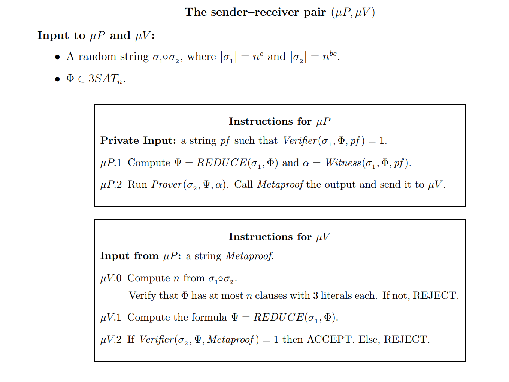

# 引言
现如今的智能合约虚拟机是一种对称式的虚拟机。即：`Ф(s)->s'`。其中`s`是原状态，`Ф`是状态转移函数，`s'`是经过计算后的新状态。由上公式可以得出，全节点验证状态转移的合法性过程需要执行一次相同的计算`Ф(s)->s'`验证`s'`是否与链上结果一致。`Ф`相当于合约代码。如果`Ф`逻辑较为复杂，这无疑增加的了全节点的性能负担，导致出块时间不平衡的等系统性风险。以太坊通过`gas limit`和`block gas limits`限制计算量保证全节点都可以在规定的时间范围内计算出数据结果。但这样同时也限制了`Ф`的复杂度，合约不能执行复杂的逻辑代码。

# MetaProofs
为此根据论文[“METAPROOFS”](https://eprint.iacr.org/2012/495.pdf)。一种新的理论证明方式引起广泛的讨论。

`MetaProofs`基于零知识证明，大致原理会生成一个证明`(Prover)`结果`µP`证明`s`通过`Ф`函数计算出`s'`。验证`(Verifier)`的时候只需要将这四个参数传入验证函数中，得到结果为`true`则可以表示状态转移是合法的。详细步骤如下图所示。

`MetaProofs`是一个证明`Prover`复杂度高，但`Verifier`快的函数。并且验证与`Ф`函数本身的复杂度无关。
因此将`MetaProofs`引入区块链，链下`Prover`生成，链上`Verifier`。既可以使智能合约处理更复杂的逻辑代码，又可以降低全节点的计算负载。不仅如此`MetaProofs`也可以生成单个链的证明，从而对分片和layer2有更好性能提升。

**注：** 此处因作者水平有限，如有理解偏差。欢迎讨论告知。
# 相关的语言
## Lurk
Lurk 是一种用于图灵完备递归 SNARK 的开发中的编程语言：
- https://github.com/lurk-lang/root

## yatima
yatima 是一个去中心化网络的编程语言
- https://github.com/yatima-inc/yatima

# 参考文献
> https://eprint.iacr.org/2012/495.pdf  
> https://www.youtube.com/watch?v=iQkedSqQH34