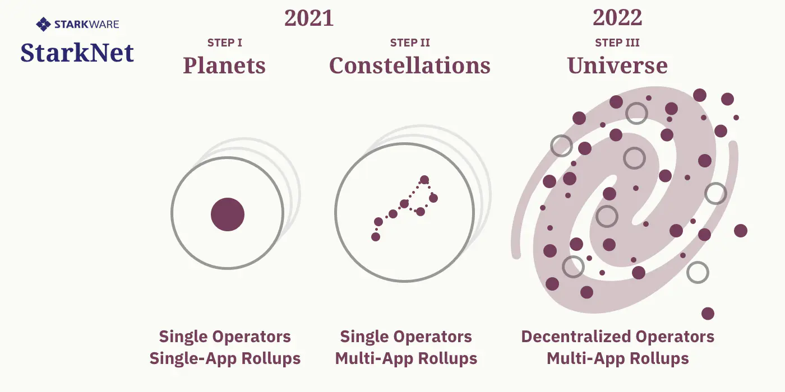
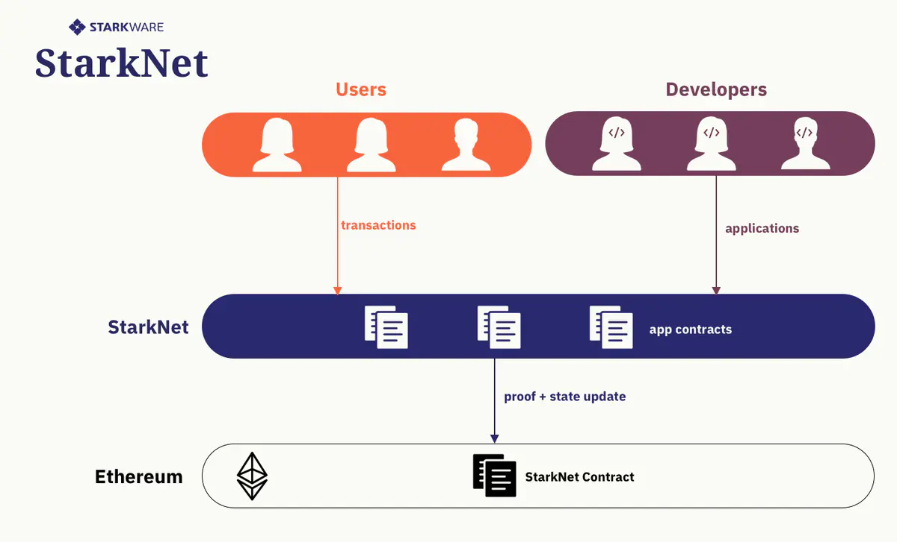
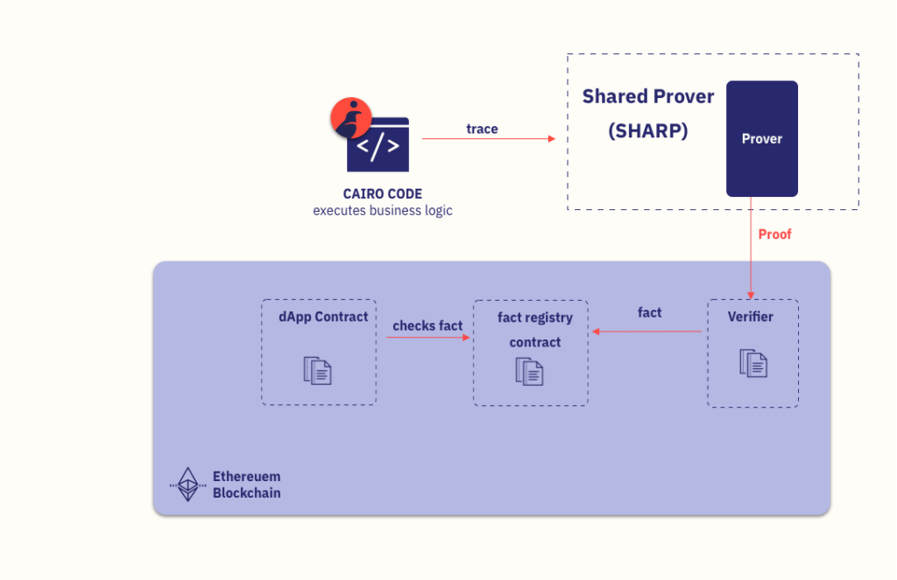
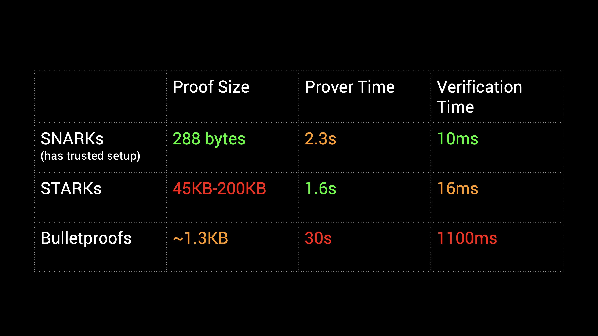
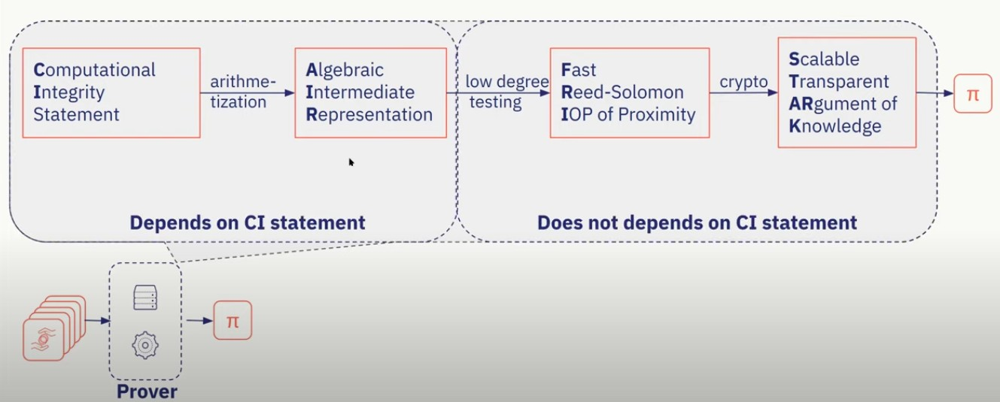

# StarkNet
[StarkNet](https://starkware.co/starknet/)是基于STARK零知识证明方案的L2的ZK-Rollup.

## RoadMap
分四个步骤构建StarkNet：
- 阶段0——地基（Foundations）（已完成*）
- 阶段I——行星（Planets）：单一应用汇总（Rollup）
- 阶段II——星座（Constellations）：多应用汇总
- 阶段III——宇宙（Universe）：去中心化汇总

StarkNet基于图灵完备的[Cairo语言](https://www.cairo-lang.org/)，支持以太坊上通用的计算。

在StarkNet上，开发者可以构建应用并部署；用户可以发起交易并在StarkNet上执行； 节点可以通过激励保证网络良好运转。

StarkNet的所有交易周期性地批量打包到一个proof中，在以太坊上验证。

所有构建StarkNet的数据在链上（on-chain）发布。

## TPS
在主网上使用单个证明处理 30 万笔交易，在 Rollup 吞吐量上创下了高达 3000 tps 的世界记录。在此过程中，我们同样在 Rollup 的 gas 效率上创下每笔交易 315 gas 的世界纪录，比以太坊 L1 上的交易便宜几个数量级。

## 阶段
### 行星：只支持单一 App 的 Rollup
在该阶段，开发者可以在 StarkNet 上构建并部署他们自己的可扩展应用。

每个 StarkNet 实例都能运行一个应用。不同的实例可能会运行不同的应用。

StarkNet 架构包含以下部分：
- 为任意 Cairo 逻辑生成 STARK 证明、然后提交证明并在以太坊上验证所需的机制
- 与 L1 以太坊交互：L1 代币的存取、链上数据的发布、保护用户免受恶意 StarkNet 运营者攻击的逃跑机制
- L2 用户余额以及应用存储项的管理

开发者只需专注于根据自己的商业逻辑构建应用，然后正式上线：在 StarkNet 上部署并大规模运行。

我们之所以能构建通用计算可扩展 ZK-Rollup，主要依赖于以下两点：
- 通用型图灵完备的编程语言 Cairo
- 我们强大的 STARK 技术（证明器和验证器），可以将大量计算捆绑到一个证明中
### 星群：支持多 App 的 Rollup
该阶段将支持多个应用在同一个 StarkNet 实例上运行，并访问同一个的全局 L2 状态。这样一来，不同应用之间将具有互操作性，而且规模经济也有助于降低 gas 成本。

强大的 STARK 栈 Cairo 和 GPS 增强了 StarkNet 在支持多 App Rollup 方面的竞争优势。

在这一阶段，StarkNet 将成为一个功能完备的框架，可以在以太坊的基础上运行多个商业逻辑不同的应用，每个实例都由一个单独的运营者来运行。

运营者可以运行 StarkNet 节点，应用开发者可以在上面部署自己的合约。从用户的角度来说，StarkNet 感觉上跟以太坊差不多，但是在可扩展性上强于以太坊。

### 宇宙：去中心化 Rollup
StarkNet 发展的最后一步是实现去中心化运营。

关于该阶段，我们现在正在解决一些有趣的研发问题，包括：（i）使用 ZK-Rollups 来改进共识机制，以及 （ii）设计密码学经济机制来激励去中心化 StarkNet 贡献者和运营者（交易排序者、证明者等）高效、公平且安全地运行。

# STARK
## 什么是 STARK
STARK 是一个证明系统。

**复杂度：**
- 证明者时空复杂度：O(nlogn) 准线性
- 见证长度和验证时间：O(log_{2}n) 亚线性

在没有Cairo之前我们需要对每个问题都去创建特殊的代数中间件（arithmetic intermediate representation, AIR）。Cairo相当于建立了一个通用的AIR，类似ASIC->CPU的转换。

## 生产级图灵完备 STARK
**概念：** 一个链下证明者，它处理大量计算（如大批量交易），并产生指数级较小的有效性证明，然后在链上进行验证。

## 什么是 Cairo
Cairo 是图灵完备的高级编程语言和框架，可以为通用计算生成 STARK 证明。应用开发者可以使用 Cairo 定义任何商业逻辑，在链下生成证明，并在链上进行验证，而无需自己编写复杂的“电路”或 AIR。Cairo 已在主网上线，向所有开发者开放。

我们将在以太坊公共测试网上发布 Cairo 的通用证明服务（Generic Proof Service ，GPS）的 alpha 版本。通过该服务，开发者可以使用 Cairo 构建自己的应用，实现他们想要的一切商业逻辑。他们会将自己的 Cairo 代码发送至 GPS 来生成证明，再在链上进行验证。

GPS 可以使用单个证明来证明多个独立应用的执行完整性，让这些应用可以分摊证明验证的 gas 成本。

Cairo 和 GPS 都是 StarkNet 的基础。我们决定将二者开放给外部开发者，让他们早些接触 StarkNet 技术。这样一来，开发者不仅可以开始在 StarkNet 的基础上进行构建，还能影响 StarkNet 的发展。

我们会基于开发者社区的需求和反馈继续开发 Cairo。我们会引入新的功能、语法和能够提高其可用性的内部插件来强化该语言。我们会继续开发并改进 Cairo 工具：编译器、跟踪器/调试器以及与通用 IDE（集成开发环境）的集成。

StarkNet 也会在底层运行 Cairo。

## Cairo 与区块链结合
今天，大多数区块链 dApp 基本上是一个实现某种逻辑的 Solidity 合约，可能是一些用于良好用户体验的前端，也可能是后端。这些 dApp 成功后，不可避免地面临可扩展性问题。

我们越来越多地看到 dApp 通过转向基于证明的 L2 可扩展性解决方案（如带有 StarkEx 的 DeversiFi）来解决其可扩展性问题。链下组件接管了业务逻辑的一些更复杂的部分，并与链上智能合约进行通信，而不会放弃安全性，因为系统状态的所有更改都经过证明。规模得到改善，因为验证链上证明比完全在链上执行业务逻辑要便宜得多。

在开罗之前，创建一个涵盖特定业务逻辑的证明系统很困难（就像通过在硅晶片上放置与非门来为该业务逻辑构建芯片一样）。在开罗，使用证明来实现可扩展性的障碍要低得多。你在开罗编写你的复杂逻辑，在链下证明它（我们将在一分钟内解释如何），一旦证明在链上得到验证，你的智能合约应用程序就可以无信任地使用结果——就好像它执行了那样链上的复杂逻辑，因为这就是证明所断言的。

## 如何工作
以太坊上的三件事是昂贵的：计算、传输和存储。开罗解决了所有三个问题。要了解它是如何做到的，我们需要引入一个新概念——共享证明器（或 SHARP）。 

SHARP 是您的开罗代码和 Solidity 智能合约之间的连接链接。它具有三个主要组成部分——证明者（链下）、验证者智能合约（链上）和事实登记合约（链上）。

证明者获取您的开罗程序的执行跟踪，证明它是有效的，并将此证明发送给验证者。检验证明后，上链验证需要一个重要的额外的步骤：将其写入一个事实，证明在事实登记证明的有效性。这个事实就像一个无需信任的批准印章，证明开罗计划的计算是正确的。现在 dApp 的智能合约剩下的就是检查这个事实是否存在，以便依赖链下执行的计算。

让我们看一个玩具示例——一个基于区块链的数独游戏，提出正确解决方案的人将获得奖励。 

今天，您需要实现验证难题的解决方案在 Solidity 中是否正确的整个业务逻辑——这是在链上执行的昂贵计算。相反，您可以在开罗编写此逻辑，然后在链外执行。Cairo 程序将检查解决方案，然后触发 SHARP 生成证明，在链上验证它并写下一个事实——一个批准该解决方案是正确解决方案的印章。数独的智能合约检查该事实是否存在，并向获胜者支付奖金。我们节省了解决方案验证的昂贵计算和链上数独游戏的解决方案的传输

dApp 智能合约的角色发生了变化——从负责执行昂贵的业务逻辑的组件变成了负责处理该业务逻辑的廉价后果的组件（在我们的示例中，将奖品发送给获胜者或更新一些state），同时依赖于业务逻辑被正确执行的事实。

我们在这篇博文中讨论了计算和传输——我们将在以后的博文中讨论开罗如何解决以太坊上的存储问题。 

## STARK的性能对比

## STARK生成过程

通常 zk-STARK 证明需要以下过程生成证明。验证者的证明过程分为两步：
1. 第一步为计算完整性声明经过算术后生成代数中间代码表示
2. 第二步为经过测试后生成 FRI (StarkWare Co-Founder 2017年所著论文中对证明的优化方法)。
   
之后经过加密算法后输出可拓展的公开透明知识论据 (也就是 STARK)。简而言之就是通过安全可信的环境以及优化算法生成一个可信并且高性能的证明。
# 参考资料
> https://www.youtube.com/watch?v=khVPrv69Zd4&t=108s  
> https://medium.com/nethermind-eth/solidity-on-starknet-terminal-velocity-e8df5f63e010  
> https://www.cairo-lang.org/cairo-for-blockchain-developers/  
> https://eprint.iacr.org/2021/1063.pdf  
> https://www.jianshu.com/p/6ce113baa464  
> https://ethfans.org/posts/on-the-road-to-starknet-a-permissionless-stark-powered-l2-zk-rollup