# Starkware
`StarkWare`是一个为了解决区块链的可扩展性和隐私的组织。 `StarkWare`开发了一个完整的解决方案，使用透明零知识证明（`zk-STARK`）技术，`zk-Rollup`和`Validium`模式组成`Volition`来生成和验证计算完整性的证明。`StarkWare`的密码证明可以做到零知识、简洁、透明和后量子安全的特点。 `StarkWare`所研发的产品主要有：`StarkNet`、`StarkEx`、`Cairo`。
## 扩展解决方案
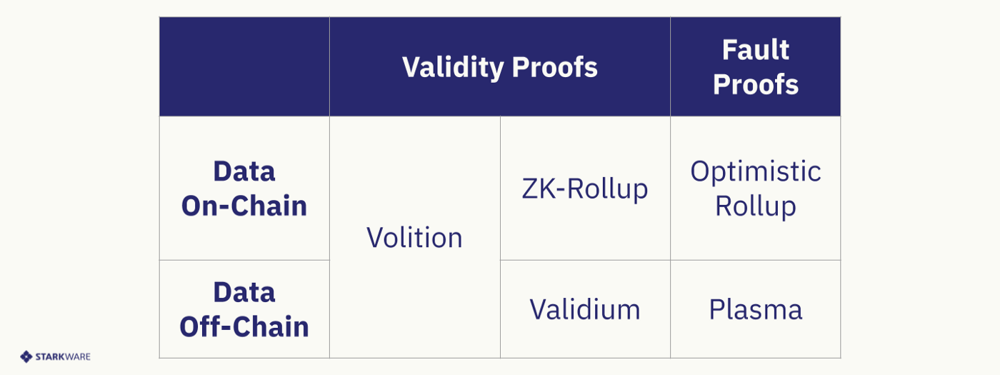
# StarkEx
`StarkEx`是基于有效性证明的以太坊可扩展性解决方案。 它可以在`zk-Rollup`或`Validium`数据可用性模式下运行。
基于`StarkEx`之上架构使用`Cairo`编写的应用程序（`dydx`、`Imutable X`...）都会定义自己的业务运行逻辑，并在`StarkEx`服务上运行。 该系统具有链上组件和链下组件。 链下组件持有状态，命令执行系统中的交易，并将状态更新发送到链上组件。 链上组件持有状态承诺，持有系统资产，并负责执行状态转换的有效性。
## 系统元件
`StarkEx`系统包含以下组件：
- 应用程序：接收用户交易的链下组件，定义业务运行逻辑和执行的顺序。最终，它将交易发送到`StarkEx`服务。
- `StarkEx`服务：链下组件，负责批处理一组操作，根据这些操作更新系统状态。针对每一批，`StarkEx`服务将发送此批的操作(作为`Cairo`执行痕迹)到`SHARP`进行有效性证明，一旦证明被验证，它将新状态发布在链上。 状态由`Merkle` `tree`呈现，其叶子是保险库。每个保险库的结构和内容根据所实施的特定业务逻辑而有所不同。`Merkle tree root`代表要在链上提交的状态承诺。
- `SHARP`(`Prover`)：`Cairo`程序的共享证明服务。 它接收来自不同应用程序的证明请求，并输出证明以证明`Cairo`程序执行的有效性。输出的证明可以在多个证明请求之间共享。
- `STARK`验证器(`Verifier`)：这是一个链上组件，用于接收状态更新有效性证明并验证该证明是否有效。
- `StarkEx`合约：该合约有两个主要功能。 第一个是在确认有效性条件得以满足后更新系统状态。第二个功能是以自主托管方式管理在`StarkEx`中的进出资金，这意味着在任何情况下，用户都可以提取其资金。

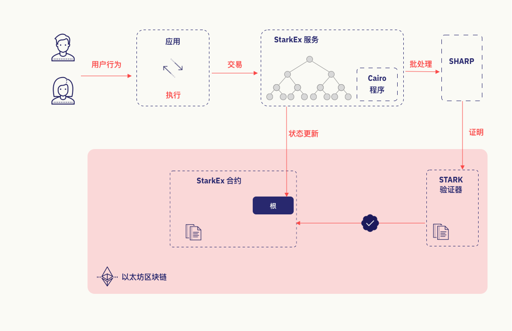
系统中的所有交易都通过应用程序执行，并将撮合好的交易发送到`StarkEx`服务。 `StarkEx`服务对交易进行批处理更新状态，并将批处理后将`SHARP`需要的参数发送到`SHARP`（共享证明服务）生成一份证明来表明批处理的有效性。`SHARP`将`STARK`证明发送给`STARK`验证器进行验证。服务随后发送一份链上状态更新交易到`StarkEx`合约，仅在证明被验证器验证有效时，交易才会被接受。

用户以两种方式与系统交互：
- 通过发送链上交易到`StarkEx`合约。
‌‌当用户想要使用该系统时，他们首先将`StarkKey`注册到`StarkEx`合约中的以太坊地址。`StarkKey`用于验证用户的链下交易。 然后，用户将其资金存入`StarkEx`合约。 在应用程序接受存款后，用户可以在链下使用其资金。
- 发送链下交易到应用程序。
用户将由`StarkKey`签名的转账或限价单直接提交给应用程序。限价单经由链下程序定序匹配，并作为结算发送给`StarkEx`服务。转账行为照原样发送。不同类型的转账交易可以由额外的逻辑来执行。
‌为提取资金，用户应向应用程序提交链下提款请求。此请求被发送到`StarkEx`服务，一旦包含提款的状态更新被接受，用户就可以在链上获取其资金。

‌为了防止审查，如果用户的提款请求没有得到实现，他们可以使用[强制操作](https://docs.starkware.co/starkex-docs-v2-chinese/cheng-xu-liu-miao-shu/qiang-zhi-cao-zuo)来强制执行。

# Immutable X
`Immutable X`使用`Starkware`基于`StarkEx`提供的方案。具体架构与上文大同小异，不再赘述。
## 以太坊上NFT接入
`NFT`接入，本质上需要让以太坊上的`IMX`合约拥有`NFT`的铸造权。
### 新的NFT接入
对于要新建的`NFT`只需要在自己的`ERC721`合约的基础上实现`IMX`给定的[Mintable](https://github.com/immutable/imx-contracts/blob/main/contracts/Mintable.sol)接口。
```js
pragma solidity ^0.8.4;

import "@openzeppelin/contracts/token/ERC721/ERC721.sol";
import "./Mintable.sol";

contract Asset is ERC721, Mintable {
    constructor(
        address _owner,
        string memory _name,
        string memory _symbol,
        address _IMX
    ) ERC721(_name, _symbol) Mintable(_owner, _IMX) {}

    function _mintFor(
        address user,
        uint256 id,
        bytes memory
    ) internal override {
        _safeMint(user, id);
    }
}
```
### 已部署的NFT接入
对于已部署过的合约，需要写一个新的合约包装进旧的合约。
确保此合约可以铸造`NFT`，并且只有`IMX`可以调此合约的`mintFor`方法。
```js
import "@imtbl/IMX-contracts/contracts/Mintable.sol";
import "@openzeppelin/contracts/access/Ownable.sol";

contract YourContract is IMintable, Ownable {

    function mintFor(
        address to,
        uint256 quantity,
        bytes calldata mintingBlob
    ) external override {
        // TODO: make sure only Immutable X can call this function
        // TODO: mint the token!
    }

}
```
## 创建项目 (project registration)
一个项目相当于一个超级管理员，并且和一个`owner`地址（拥有铸造权限）关联。用户可以在项目中发行多个合集（`collections`），`IMX`规定每个项目可以创建的`collection`数量有限制（一个月五个合集）。创建完项目后会生成对应的`projectId`。
```js
   const params: CreateProjectParams = {
    name: '项目名字',
    company_name: '公司名字',
    contact_email: '联系邮箱',
  };

  let project;
  try {
    project = await user.createProject(params);
  } catch (error) {
    throw new Error(JSON.stringify(error, null, 2));
  }
```

## 合集注册 (collection registration)
合集（`collection`）代表一个已经在以太坊网络上部署好的`ERC721`合约。为了能在`IMX`网络上铸造资产，首先需要在`IMX`上注册这个合集。
合集注册也是通过`IMX`提供的`sdk`或`api`完成，参考代码如下：
```js
    const params: CreateCollectionParams = {
    name: '合集的名字',
    // description: 'ENTER_COLLECTION_DESCRIPTION (OPTIONAL)',
    contract_address: collectionContractAddress,
    owner_public_key: ownerPublicKey,
    // icon_url: '',
    // metadata_api_url: '', //<metadata_api_url>/<token_id>
    // collection_image_url: '',
    project_id: parseInt(projectId, 10),
  };

  let collection;
  try {
    collection = await user.createCollection(params);
  } catch (error) {
    throw new Error(JSON.stringify(error, null, 2));
  }
```
在`IMX`上注册一个合集的例子可以[参考这里](https://docs.x.immutable.com/docs/asset-metadata#example-metadata-schema)。
## 元数据注册 (metadata schema registration)
`IMX`允许项目为他们的资产指定元数据属性，这些元数据属性可以更好的帮助交易市场（`marketplace`）执行复杂的过滤查询，这样帮助用户更精准的发现他们想要的资产。更多资产元数据的例子可以[参考这里](https://docs.x.immutable.com/docs/asset-metadata#example-metadata-schema)。
元数据注册也是通过`IMX`提供的`sdk`完成，参考代码如下：
```js
const params: AddMetadataSchemaToCollectionParams = {
    metadata: [
      {
        name: 'EXAMPLE_BOOLEAN',
        type: MetadataTypes.Boolean,
        filterable: true,
      },
      // ..add rest of schema here
    ],
  };

  const collection = await user.addMetadataSchemaToCollection(
    collectionContractAddress,
    params,
  );

  log.info(
    component,
    'Added metadata schema to collection',
    collectionContractAddress,
  );
  console.log(JSON.stringify(collection, null, 2));
```
在`IMX`上创建注册元数据的例子可以[参考这里](http://0x0e3a2a1f2146d86a604adc220b4967a898d7fe07)。
## 功能时序图
### 铸造
管理员给`IMX Engine`发送铸币请求并附带签名，`IMX Engine`执行批次化后交由`Prover`进行生成有效性证明生成`Proof`提交到以太坊的验证合约进行验证。
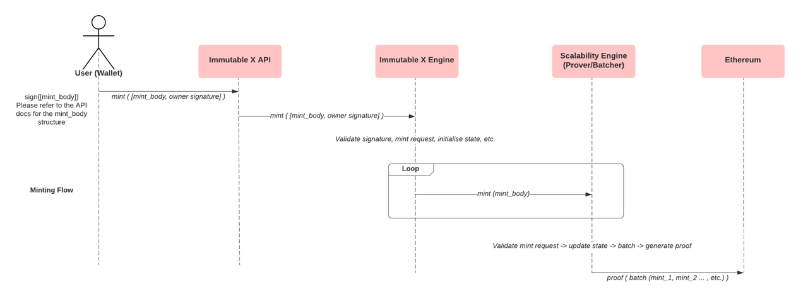
### 存款
用户发送代币转账到以太坊合约中，`IMX Engine`监听到存款事件后更改网络状态后交由`Prover`进行生成有效性证明生成`Proof`提交到以太坊的验证合约进行验证。
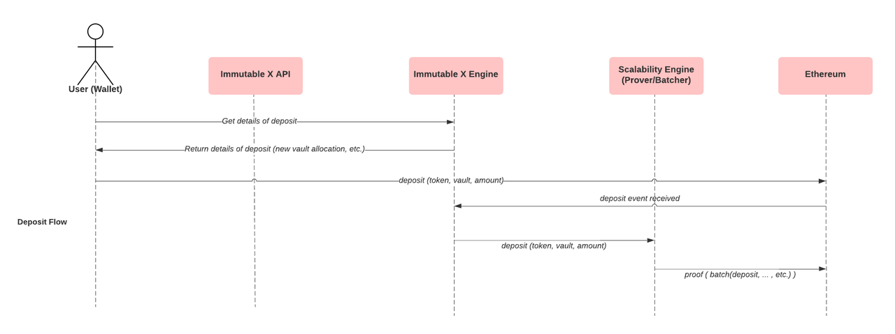
### 取款
- 一般情况：链下触发。用户发起提款请求。`IMX Engine`执行批次化后交由`Prover`进行生成有效性证明生成`Proof`提交到以太坊的验证合约进行验证。验证通过后用户在以太坊上调用取款取出资产。
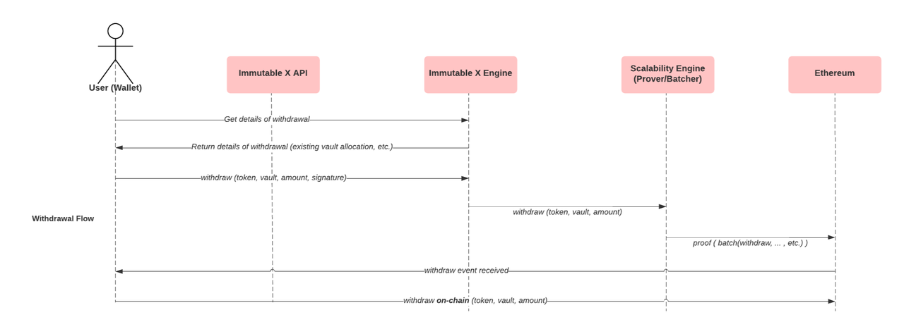
- 特殊情况（例如：`IMX Engine` down掉）用户可以直接调用链上的紧急退出功能经过锁定时间窗口后取出所有资产。
### 交易
`IMX Engine`内维护了一个中央订单簿。用户创建卖单将在`IMX Engine`中进行维护。当`IMX Engine`接收到对应买单会自动撮合，随后交由`Prover`进行生成有效性证明生成`Proof`提交到以太坊的验证合约进行验证。
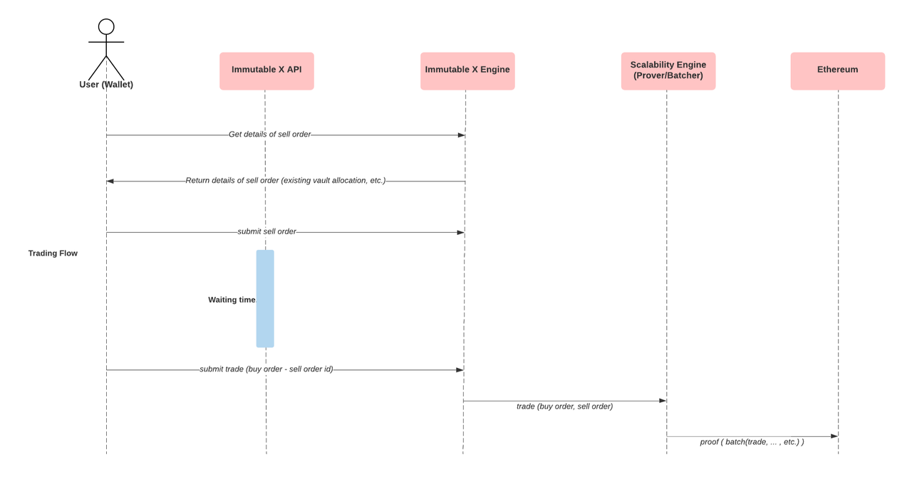
## SDK && API
`Immutable X SDK` 是一个由`Immutable`创建的`Javascript`包，允许与`Immutable X`的`API`进行简单接口。主要使用的包是 `Link SDK`和`Immutable X Client`。
`Immutable X Client`用于大多数后端操作，`Link SDK`用于前端、面向用户的交互。

[SDK](https://docs.x.immutable.com/docs/sdk-api)  
[API](https://docs.x.immutable.com/reference/get_v1-orders)  
[API调用限制](https://docs.x.immutable.com/docs/api-rate-limiting)  
# 探索 StarkNet
## 几个概念
### 状态机
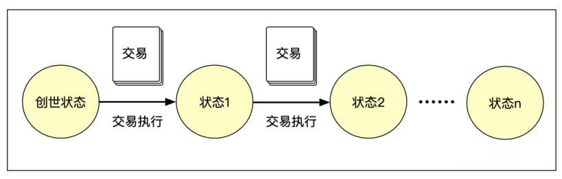

```Y(S, T)= S'```

给定一个旧的有效状态 `（S）`和一组新的有效交易 `（T）`，以太坊状态转换函数 `Y（S，T）` 产生新的有效输出状态`S'`。
### Re-Execution
是一种通过执行相同的计算来证明一个事实。
### 零知识证明
零知识证明的目标是让验证者相信证明者拥有某个秘密(`withness`)，满足某种关系，而无需向验证者或其他任何人透露秘密本身。
定义：
- 完整性（`Completeness`）：如果证明者是诚实的，那么她最终会说服验证者。
- 可靠性（`Soundness`）：证明者只能说服验证者该陈述是否属实。
- 零知识性（`Zero-knowledgeness`）：除了知道陈述是真实的，验证者不知道任何额外的信息。
## 区块链解决了什么问题？
信任问题：系统A如何相信系统B陈述了一个事实。
### 经典系统
- 传统中心化账本系统：数据都存在一个大型计算机的账本系统中，用户使用时必须相信这个系统。
- 经典区块链系统：区块链具有包容性和问责制。每个操作员都有一个账本系统，操作员除经过自己验证数据可信之外，并不相信任何人的数据。每个操作员都需要验证所有交易的有效性。

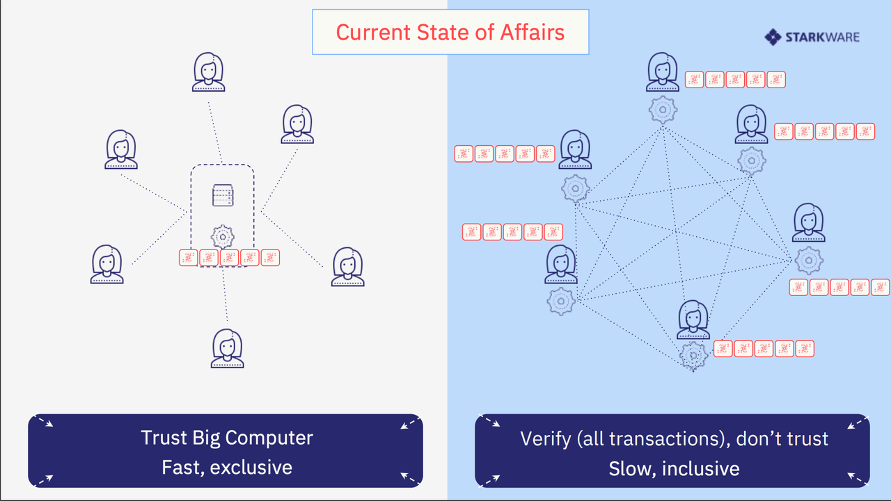
区块链系统为了验证数据，所有交易都要公开在网络中，牺牲了数据的隐私性。
### 解决方案
- 增量扩容：通过扩大区块内交易数量或计算逻辑会导致操作节点需要更强的性能来处理更多的数据，越来越多的节点因为机器性能不足从而退出网络。导致节点数量减少，偏向于中心化。
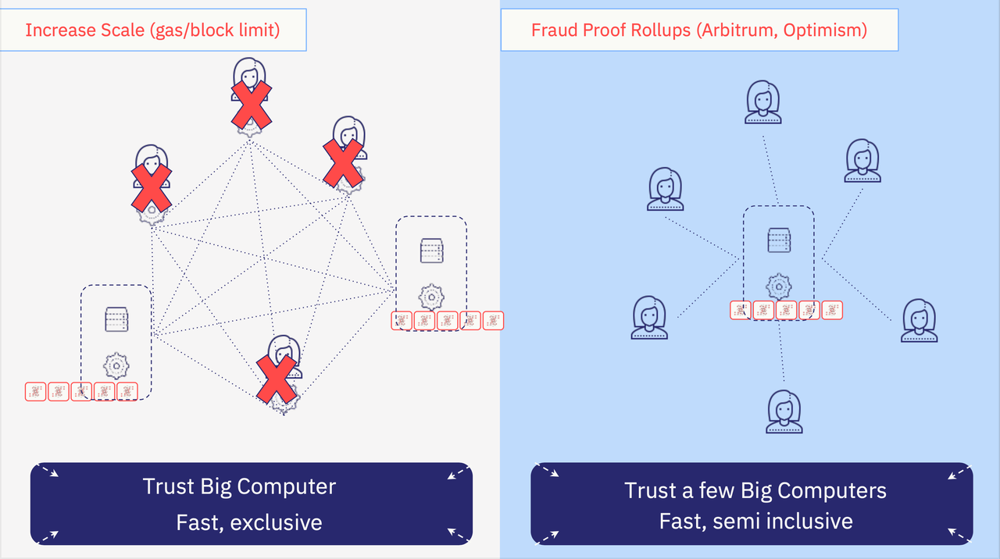
- 有效性证明系统：有效性证明将操作员拆分为二：证明者（`Prover`）和验证者（`Verifier`）。证明者执行数据逻辑生成一个证明（`Proof`）交由给验证者网络，使验证者可以通过验证这个证明本身就可以相信证明者数据的有效性。有效性证明是个`NP`问题（证明困难，验证简单）。既保证了数据的隐私，又可以让验证者轻易的相信数据可靠。
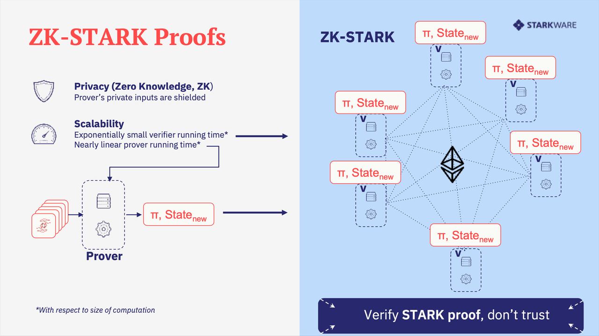
## ZK-STARK Proofs 
`zk-STARK`不需要可信设置（`non-setup`），是一种透明化的零知识证明系统。

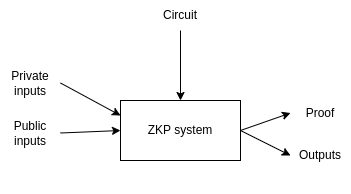
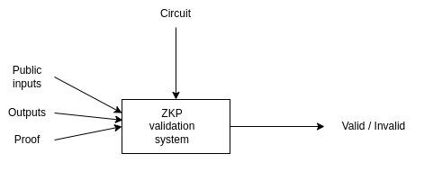
验证者只需验证`Proof`就可以相信证明者发送的最新状态，而不需要验证交易本身。
### Zkp常见系统比较
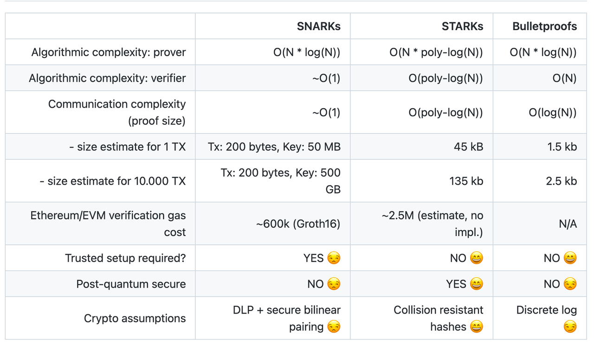

从上图可看出：`STARKs`的证明、验证和见证大小复杂度均高于其他系统（多项式对数复杂度随着规模扩大，系统效率越高，所以要进行批次化）。优点是不需要可信设置（`Trusted setup`），并且他的加密假设是基于哈希碰撞，具有良好的后量子安全的特点。
## Cairo Language
`Cairo`是一种用于为一般计算创建`STARK`证明程序的图灵完备语言。`Cairo`为`StarkEx`提供支持，后者可扩展`Mainnet`上的应用程序（包括 `dYdX`、`Sorare`、`Immutable X`和 `DeversiFi`）。`Cairo`是`StarkNet`的原生智能合约语言。
## StarkNet
`StarkNet`是无须许可的去中心化的`zk-Rollup`。它作为以太坊的`Layer2`网络运行。在`StarkNet`上使用`Cairo`开发的`dApp`，可以支持无限规模的计算。
特点：
- 可扩展性和完整性：`StarkNet`支持规模化，可以使用`Layer1`以太坊的安全性，通过在链下生成`STARK`证明，然后在链上进行验证。
- 通用性：在`StarkNet`上，开发人员可以使用`Cairo`编写智能合约轻松部署任何业务逻辑。
- 可组合性：`StarkNet`提供以太坊级别的可组合性，促进轻松开发和创新。
### 路线图
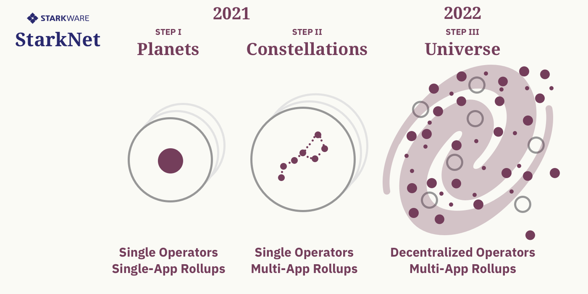
- 阶段一 `Planets`: 单应用、单操作节点的`Rollups`
- 阶段二 `Constellations`: 多应用、单操作节点的`Rollups`
- 阶段三 `Universe`: 多应用、去中心化节点的`Rollups`
### 当前进度
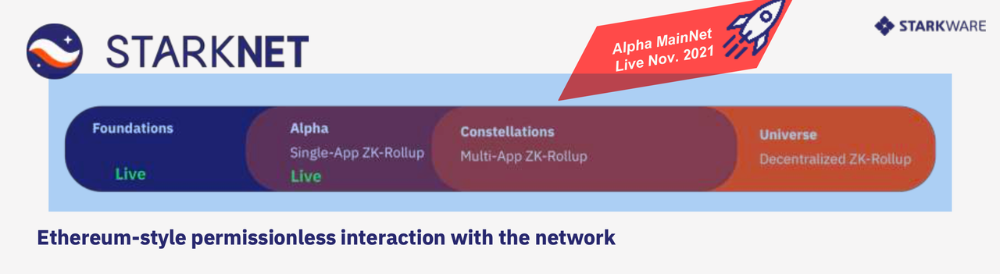
### 架构图
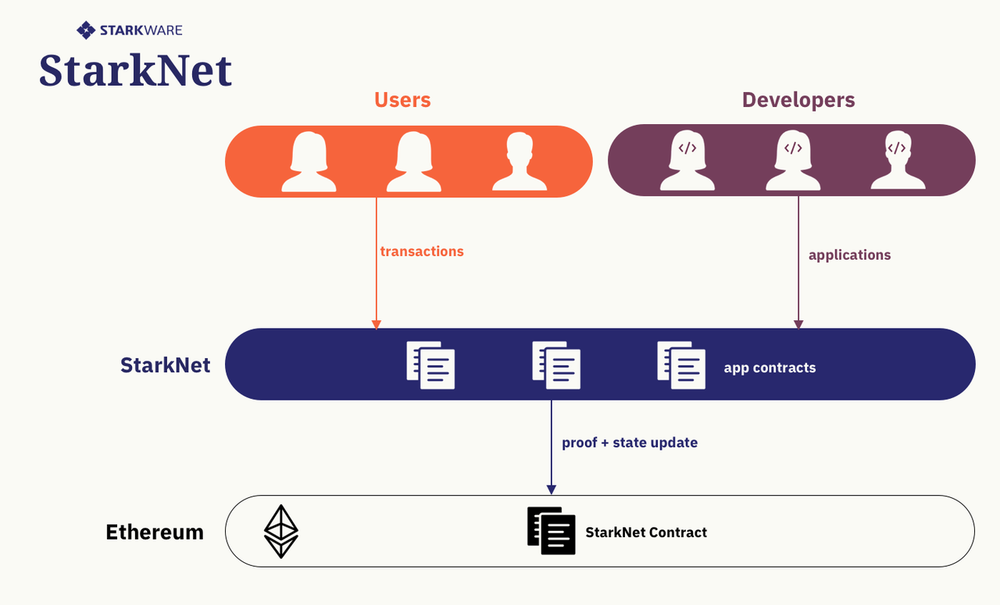
`StarkNet Full Node`：`StarkNet`网络中的一个节点，仅用于查询当前StarkNet状态。
`StarkNet Sequencer Node`：`StarkNet`网络中用于定序和生成零知识证明的节点。相当于`StarkNet`的矿工。
## 递归零知识证明
### 定义
递归零知识证明：使用前一个状态的`Proof`以及当前交易作为输入，接下来`Prover`去尝试证明前一个状态的`Proof`以及当前交易是否有效，如果全部验证通过，程序会输出一个新的状态及一个`Proof`，过程如下图所示：

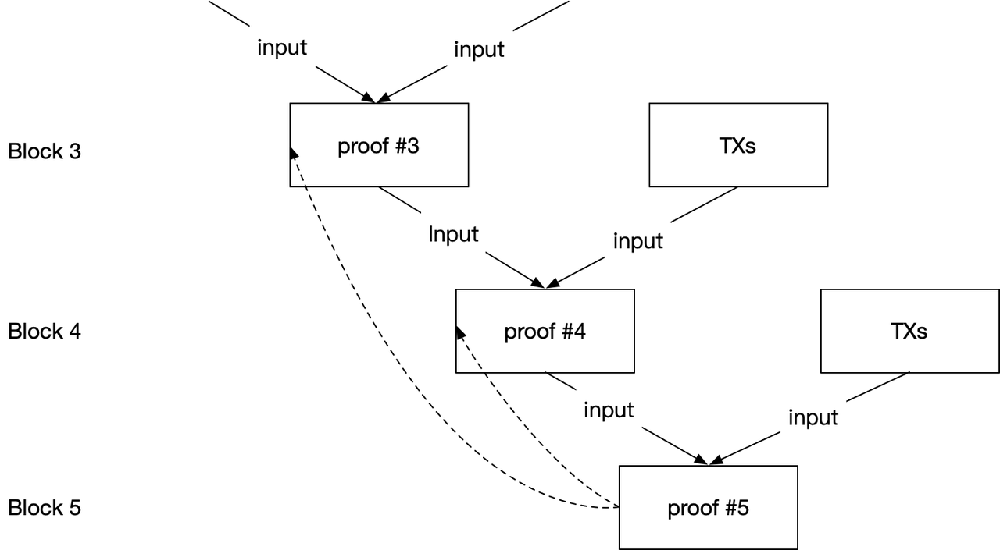
递归零知识证明验证：只要验证前一个状态的`Proof`就可以验证整个链的状态，比如：当验证`Proof #5`状态是正确的，相当于递归验证了`Proof #4`，`Proof #3`。

`Mina`（旧称`Coda`）项目，将整个区块链维持在22k，其中就使用了递归零知识证明。
优点：递归零知识证明有非常好的聚合（压缩）、节省空间的优点。
### 多层网络
某些`dApp`需要特殊的定制，这可能更好地在此层基础上，构建一个新的独立层提供服务。
具体过程：
- 每层网络都有一个`Cairo`程序，它可以作为该层网络的共识，或具体的业务。
- 下层网络提交`Proof`和`State Update`（在`zk-rollup`需要包含与之相关的`Merkle Tree`，在`Validium`下只需要`Merkle Tree Root`）到该层`Prover`进行定序和批次化。
- `Prover`使用`State Update`更新该层网络状态对应下层网络`Key`「保险库」的`State`。
- `Prover`调用该层`Cairo`程序并输入`Inputs`（更新前的网络状态）、`Outputs`（更新后的网络状态）、`txs`（下层网络提交的`Proofs`和`State Update`），生成该层的`Proof`和`State Update`，并将提交到上层网络的`Verifer`验证。

注意：此处是一个递归化的过程。
每层网络中都维护一个网络状态。
利用零知识隐私化的特性，每层网络只需要关心当前层的网络状态合理化而无须关心下层网络本身。

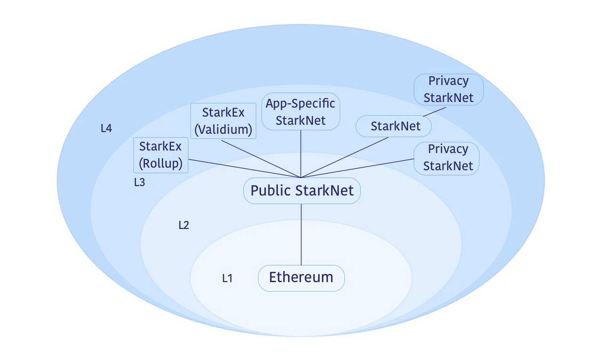
### 经典Layer2架构
- `L2 Contract`：记录`Layer2 State/Root`的合约。
- `Verifier Contract`：用于验证`Layer2`状态转移有效性的`Verifier`的合约。
- 桥接`Layer1`、`Layer2`的资产出入管理合约。
- `ERC20/ERC721`账户模型对应网络的镜像。

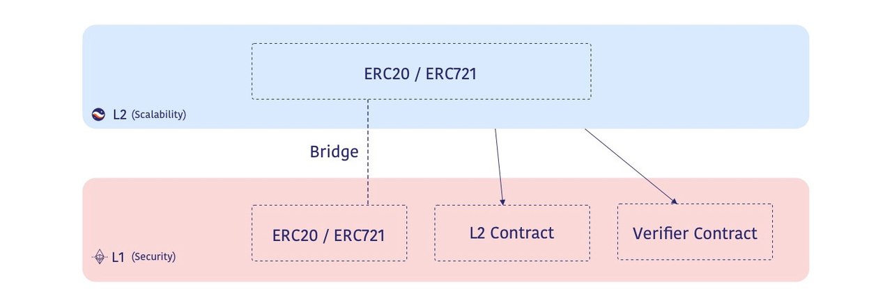
### 应用在Layer3上
与`Layer2`在`Layer1`一样，`Layer3`也可以使用相同的结构并添加差异化的功能。
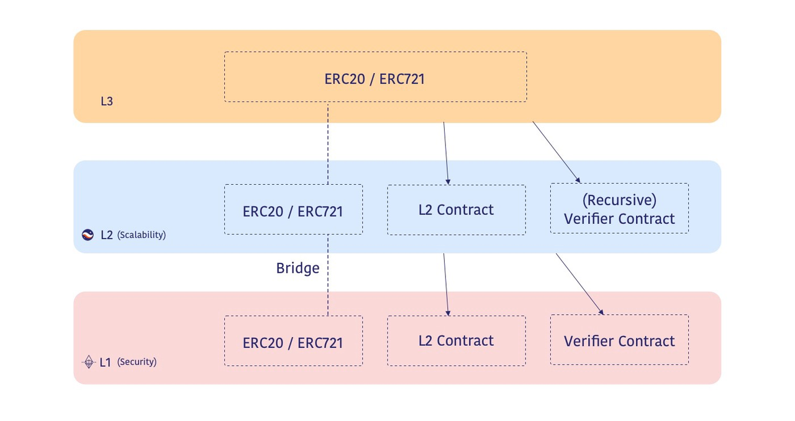
# 参考资料

> https://medium.com/starkware/fractal-scaling-from-l2-to-l3-7fe238ecfb4f
> https://medium.com/starkware/redefining-scalability-5aa11ffc5880
> https://iosgvc.medium.com/scaling-summit-2021-keynote-recap-stark-validity-rollup-an-ultimate-scaling-technology-9cc62b307f69

