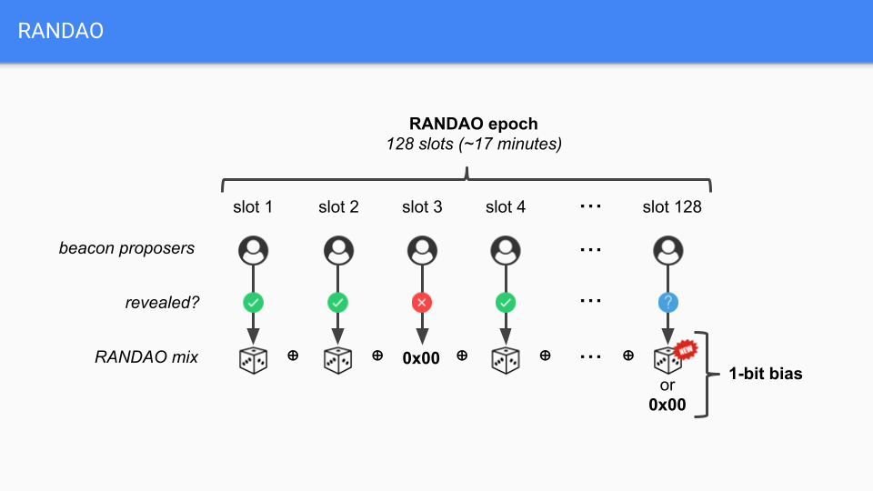

# 区块链中的随机数
在权益证明（PoS）区块链中，随机性对于验证人职责的公平且不可预测分配很重要。

计算机并不擅长随机数，因为它们是确定性设备（相同的输入始终会产生相同的输出）。通常大家在计算机上（例如在游戏应用程序中）所说的 “随机数” 实际上是伪随机的。也就是说，它们依赖于用户或其他类型的 Oracle（预言机）提供的足够随机的种子，例如气象站的大气噪声、你的心律，甚至是熔岩灯，它都可以从中产生一系列看似随机的数字。但是给定相同的种子，将始终生成相同的序列。

然而，这些输入将根据时间和空间而变化，而且不可能将相同的结果输入到全球特定区块链的所有节点中。如果节点获得不同的输入并用它来出块，则会发生分叉。显然，现实世界的无序状态不适合用作区块链随机性的种子。

目前区块链生产环境中使用的随机数方案主要有2种：
- RANDAO
- VRF

polkadot、filecoin、Algonand 采用的是VRF方案。  
ETH2.0 采用RANDAO + VDF 方案。
# VRF
可验证随机数(Verifiable Random Function)

VRF具有：
- 唯一性（对于同一消息，多次签名均为唯一相同结果的基于公钥签名机制）
- 抗碰撞性
- 伪随机性

VRF的算法主要包含`VRFkeygen`, `VRFeval`, `VRFverify`.

## 采用VRF生成随机数
可验证随机函数（VRF）是一种数学运算，需要一些输入并产生一个随机数以及该提交者生成该随机数的真实性证明。任何挑战者都可以验证该证明，以确保随机数生成有效。

Polkadot 中使用的 VRF 与 Ouroboros Praos 中使用的 VRF 大致相同。Ouroboros 的随机性对于出块来说是安全的，并且对于 BABE 也运行得很好。它们的不同之处在于，Polkadot 的 VRF 不依赖于中央时钟（问题变成了 “谁控制中央时钟？”），而是取决于它自己的过去结果来确定现在和将来的结果，并且它使用`slot`号（`slot number`）作为时钟仿真器来估计时间。

具体操作如下：

`slot`为6秒时长内的离散时间单位，每个`slot`中可包含一个区块，也可不包含。多个`slot`可组成`epochs`，在波卡中，2400个`slot`组成1个`epoch`，也就是说每个`epoch`时长为4小时。

可验证的随机函数是一个函数，在伪代码中，可以这样表示：

> (RESULT, PROOF) = VRF(SECRET, INPUT)

也就是说，对于一些`SECRET`，一些可以是公开的`INPUT`，结果是一个元组`RESULT`和`PROOF`，在这里`PROOF`可以通过外部观察来验证`RESULT`的合法性。

换句话说，进行`VRF Roll`会产生一个随机数和一个证明表示您获得了该随机数。并不仅仅是选中了你。

在每个`slot`，每个验证者会掷骰子，以下作为VRF函数的输入：
- SECRET：为掷骰子产生结果的指定特殊的key(验证者的私钥)。
- INPUT：如果链中存在的`epoch`少于2个，则它是来自创世块的特定值。如果大于2个，则是过去2个`epoch`中所有 VRF RESULT 的`hash`。INPUT内还包含`slot`的编号。

VRF的输出为：
- RESULT：产生的随机值。将该值与协议中设置的`THRESHOLD`比对，若该值低于`THRESHOLD`，则摇出该值的验证者为该`slot`的合格的区块生成候选人。该验证者创建并向网络提交区块，区块中需附带`RESULT`和`PROOF`值。
- PROOF：为该随机值的证明，证明生成该随机值的过程是正确的。

一旦验证者执行了 VRF，`RESULT`就会与协议中定义的`THRESHOLD`值进行比较。如果`RESULT`小于`THRESHOLD`，则验证器是该`slot`的有效块提议者候选者。否则，验证器将跳过该槽。

钓鱼人（fisherman）- 监视网络的收集人和验证人错误行为的节点，将验证中继链区块。由于非法投掷将产生非法区块，并且由于钓鱼人将在验证人产生的每个区块中访问 RESULT 和 PROOF，因此他们很容易自动报告作弊的验证人。

总结一下：在 VRF 下，每个验证人都会为自己掷出一个数字，并根据`THRESHOLD`对其进行检查，如果随机掷出的骰子低于该`THRESHOLD`，则会生成一个区块。观察网络并报告不良行为的钓鱼人事后会验证这些投掷的有效性，并向系统报告任何作弊行为（例如，有人尽管掷出的数量超过`THRESHOLD`，但仍然假装成出块者）。

精明的读者会注意到，由于这种工作方式，某些`slot`可能没有验证人作为出块候选者，因为所有验证人候选者的得分都太高而错过了`THRESHOLD`。我们阐明了如何解决此问题，并确保与 Wiki 页面的共识部分 的 Polkadot 出块时间保持几乎一致。

# RANDAO

RANDAO是利用经济模式（奖励跟处罚）的方式，促使在公共场域中能产生随机变量

原理很简单，想参加的人把拿钱来抵押，需要产生随机数的人要付钱。所以参加者就可以从中分润，当然不守规矩抵押的钱也就会被没收，利用奖励跟处罚的方式迫使大家都守规矩。详细步骤如下：

首先，会有个收集seed的时间，例如6个block的时间。接着，想参与的人，投入某个数量的ETH到RANDAO这个smart contract（作质押），然后附上secret（某个只有你知道的值s，然后作sha3）。

1. 等收集时间结束，就是验证时间。此阶段所有参与着需要把s传入smart contract做验证，smart contract会把s作sha3，去验证是不是跟第一阶段传进来的一致。最终会把验证过的s当作seed去产生随机数。

2. 最后，就是产生随机数，然后把随机数传给之前有请求过的contract。然后归还质押的ETH跟利润分给参与者。

此外有几个附加条件：

1. 第一阶段若收集到数笔一样的secret，只接受第一笔；

2. 第一阶段会规定基本人数，若结束后未到达人数门坎，则此次的产生就失败；

3. 若第二阶段需提供s；
    1) 若未提供，则质押的ETH会被没收；
    2) 若此阶段有一个以上参与着未提供s，则此次产生失败，并且把没收的 ETH分给有提供s的参与者。且退还请求者所支付的ETH；

RANDAO会在内建在Beacon chain的逻辑中，而不是一个独立的smart contract，但RANDAO有个缺点，就是最后一位可以预测/操纵结果。如下图，因为最后一位可以知道前面的值，所以在最后可以决定要出值或是不出，因此可以操纵结果。(目前epoch是64个slot，而每个slot是6秒，所以epoch约是6.4 minutes)

对于这一问题，以太坊 2.0 将通过 VDF （可验证延迟函数）来解决！

# RANDAO + VDF

VDF把RANDAO产生出来的随机数当种子去产生随机数，而且计算时间要够长

VDF 全称为 Verifiable Delay Function （可验证延迟函数)。

其言外之意就是此类行数需要花很长时间来进行计算。

比如，对数字 X 来说，一种 VDF 可以是 X 的连续 6 次平方：

((((((X^2)^2)^2)^2)^2)^2)^2
假如 X=5，那么最终结果就是：

((((((5^2)^2)^2)^2)^2)^2)^2 =(((((25^2)^2)^2)^2)^2)^2 =((((625^2)^2)^2)^2)^2 =(((390625^2)^2)^2)^2 =((152587890625^2)^2)^2 =(23283064365386962890625^2)^2 =542101086242752217003726400434970855712890625^2 =293873587705571876992184134305561419454666389193021880377187926569604314863681793212890625
随着计算的继续，计算的结果将越来越大。一个复杂的 VDF 将需要花费很长的时间才能计算出来，因为对于任何计算机来说，其计算过程都是非常复杂的。这个例子来源于一个真实的 VDF，直到现在它还是在 MIT 的一个时间胶囊密码学谜题的一部分，该 VDF 用了 80 万亿次平方。

那么这有什么意义呢？

首先，在计算最终数字时的延迟（delay）是可以 验证的，我们知道哪些计算机操作是达到结果所必需的，并且能够以合理的精确度确定机器达到结果所需要的时间。

其次，如果要计算出第三级结果，那计算机就 必须 先计算出第一级和第二级的结果 —— 我们无法在多台计算机上并行地进行此计算，因为每个新的输入都依赖于之前的输出，而且每个输出都需要预先确定的计算时间。

如果现在我们用 RANDAO 中的随机数来代替上方 VDF 例子中的数字 X，且如果函数的指数不是 6 而是好几千，并且函数不是使用平方（^2）而是更复杂的函数，那么我们将得到一个完全不同的函数，这个函数会将 RANDAO 的结果转变成另一个完全不一样的随机数，而且要计算出这个结果将需要花上一段时间，不管你拥有多少台电脑。

以太坊随机数生成机制：RANDAO 与 VDF 的完美结合

通过引入这种延迟，并使计算的时间要长于验证者可以通过影响某个随机数而获得利益的时间，我们就可以消除最后一级的随机性偏差 —— 即消除单个验证者可以对 RANDAO 结果产生的最后一点操控。

在以太坊 2.0 阶段，这个 VDF 被定义为 102 分钟时长 —— 超过了一个半小时。当前以太坊基金会正与 Filecoin 等区块链项目合作，资助开发一种针对此计算优化的开源 ASIC —— 这是一种专门用来进行这种计算的微型计算机。该机器将由爱好者、加密货币项目和其他区块链平台甚至验证者来运行，它具有一个小优势，可以第一时间响应 VDF 检查，而且不需要比一般的微型计算机全节点更高的电力成本。

这样一种高度专业化的机器确保了任何其他试图对 RANDAO 重获最后一点影响的人，都必须开发出比当前的 ASIC 效率高 100 倍的机器。开发这种设备将耗资巨大，除非真有某种一本万利的用途；而如果能开发出来的话，几乎可以完全摧毁以太坊。

在以太坊 2.0 阶段，每 6.4 分钟称为一个时间段（epoch)。每经过一个 epoch， RAODAO 就揭晓一次，同时这也意味着每过一个 epoch 我们就得运行一个新的 VDF。每个 VDF 的周期是 102.4 分钟，因此总会有 16 个 VDF 同时运行。VDF 得到的结果即作为随机性种子，用来选定下一组验证者，保证公平性。

**。。未完留坑**
# 引用和参考文献
> [PolkadotWiki](https://wiki.polkadot.network/docs/learn-randomness)  
[波卡的随机性](https://www.panewslab.com/zh/articledetails/D50471778.html)