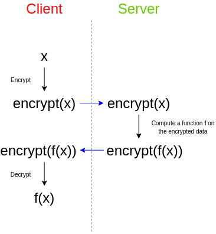
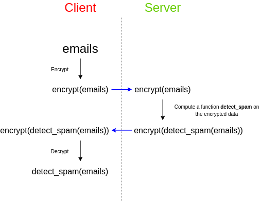

# 全同态加密是什么
近几年对于个人隐私保护的话题越来越多，包括同态加密在内的一系列密码学应用技术也得到了很广泛的普及。在了解全同态加密（Fully Homomorphic Encryption/FHE）之前我们先了解下同态加密。

# 同态加密
同态加密体系大致上被分为四类：部分同态、近似同态、有限级数全同态与完全同态。

## 部分同态加密
部分同态加密（Homomorphic encryption）也叫半同态加密，是一种加密形式，它允许人们对密文进行特定形式的代数运算得到仍然是加密的结果，将其解密所得到的结果与对明文进行同样的运算结果一样。
半同态加密模式：
- 加法同态：满足$E(X)E(Y)=E(X+Y)$。典型的例子为：椭圆曲线加密算法中，$E(x)=gx$（其中g为椭圆曲线的generator），则$E(x)E(y)=gxgy=g(x+y)=E(x+y)$，具有加法同态性。 以及Pedersen Commit也具有加法同态性。
- 乘法同态：满足$E(X)E(Y)=E(XY)$。典型的例子为：RSA加密算法中，$E(x)=x^e$（其中e为公钥），则$E(x)E(y)=x^ey^e=(xy)^e=E(xy)$，具有乘法同态性。

在加密计算中，加法同态可以完成任何加法运算。乘法同态亦然。

## 近似同态加密
如果我们又想让私密输入相乘，又想得到它们之间的线性组合的话，单纯的部分同态加密算法（RSA，ElGamal）是无法完成的。所以我们就需要来到下一阶段。

部分同态加密的下一阶段是近似同态加密，这一阶段距离我们想要实现的全同态更近了一步。如果我们有近似同态加密算法的话，那么我们就可以在密文上同时计算加法与乘法了。但是需要注意的是，正因为这一阶段是近似同态（Somewhat Homomorphic）的，所以可以做的加法和乘法次数非常有限，可以计算的函数也在一个有限的范围内。**因为我们不能计算任意逻辑和深度的函数。**

## 有限级数全同态加密
来到下一个阶段之后，我们距离全同态的目标更进一步了。

这一阶段被称之为有限级数全同态加密。在这一阶段的话，我们已经可以对密文进行任意的加法乘法组合了，没有任何对于次数的局限性。

但是之所以被称之为有限级数全同态的原因是，这个阶段的算法会引入一个新的复杂度上限$L$的概念，这一复杂度上限约束了函数$F$的复杂度。如果我们可以把$F$用二进制电路$C$来表示的话，**那么$C$的深度和大小一定要在$L$的范围之内。**

## 全同态加密
全同态加密的系统**没有任何计算方法的限制**，我们可以允许第三方对加密数据执行计算，并获得加密结果，他们可以将其交还给拥有原始数据解密密钥的任何人，而第三方无法自行解密数据或结果。

# 应用例子
假设您有一些电子邮件，您想通过第三方垃圾邮件过滤器来检查其中的垃圾邮件，又不希望第三方获取邮件中的内容。所有您可以使用全同态加密做以下方案：

这样第三方获取的是加密后的数据，他只需要在加密后的数据上做计算，将结果返回给您进行解密，即可得到计算后的原文结果。

对于区块链技术，同态加密也是很好的互补。使用同态加密技术，运行在区块链上的智能合约可以处理密文，而无法获知真实数据，极大的提高了隐私安全性。

目前全同态的加密方案主要包括如下三种类型：
- 基于理想格（ideal lattice）的方案：Gentry 和 Halevi 在 2011 年提出的基于理想格的方案可以实现 72 bit 的安全强度，对应的公钥大小约为 2.3 GB，同时刷新密文的处理时间需要几十分钟。
- 基于整数上近似 GCD 问题的方案：Dijk 等人在 2010 年提出的方案（及后续方案）采用了更简化的概念模型，可以降低公钥大小至几十 MB 量级。
- 基于带扰动学习（Learning With Errors，LWE）问题的方案：Brakerski 和 Vaikuntanathan 等在 2011 年左右提出了相关方案；Lopez-Alt A 等在 2012 年设计出多密钥全同态加密方案，接近实时多方安全计算的需求。

# 参考资料
> https://yeasy.gitbook.io/blockchain_guide/05_crypto/homoencryption  
> https://vitalik.ca/general/2020/07/20/homomorphic.html